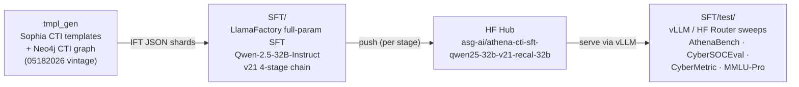

# Fine-Tuning LLMs with LlamaFactory (SFT / CPT)

This document describes the end-to-end workflow for fine-tuning a large
language model for Cyber Threat Intelligence (CTI) using
[LlamaFactory](https://github.com/hiyouga/LlamaFactory). The canonical
pipeline is **templates → train → test**: IFT datasets are generated
from Sophia CTI templates via [`tmpl_gen`](../tmpl_gen/README.md),
continued pre-training (CPT) and supervised fine-tuning (SFT) runs are
launched from [`cpt/`](../cpt/README.md) and
[`autotrain/`](autotrain/README.md), and evaluation is driven from
[`test/`](test/README.md) against the AthenaBench, CyberSOCEval, and
CyberMetric suites (with MMLU-Pro included as a general-intelligence
reference).

The current canonical SFT target is **Qwen-2.5-32B-Instruct** under the
**v21** chain — four sequential launchers producing the cumulative
`v21-core → v21-taa → v21-cse → v21-recal-32b` checkpoints. The
**`v21-recal-32b`** Stage 4 variant (32B-tuned LR / Phase-B-heavy
interleave) is the headline ship checkpoint (Total 65.0 / Weighted 62.9
on the 50/50 TAA blend, top of the v21 leaderboard across all ported
architectures). The same v21 recipe is ported byte-identically to
**Qwen-2.5-14B-Instruct** (ship: `v21-recalibrate`, Total 61.0),
**Foundation-Sec-8B** and **Llama-3.1-8B-Instruct** (8B baselines),
and **Qwen3-30B-A3B-Thinking-2507** (sparse MoE; ship at `v21-cse`
since both Stage-4 variants regress on MoE routing). CPT continues to
target **Llama-3.1-8B** (base) for corpus-level adaptation.



For the full v21 chain — template manifests, dataset shards, launchers,
recipes, sign-off gates, and stage-by-stage parameter tables — see
[`SFT_FLOW.md`](SFT_FLOW.md).

---

## Table of Contents

1. [Quick primer: AthenaBench workflow](#quick-primer-athenabench-workflow)
2. [Environment Setup](#environment-setup)
3. [Prerequisites](#prerequisites)
4. [Installation](#installation)
5. [CUDA and PyTorch Verification](#cuda-and-pytorch-verification)
6. [Pipeline reference: templates → train → test](#pipeline-reference-templates--train--test)
7. [Notes](#notes)

---

## Quick primer: AthenaBench workflow

The `SFT/` tree plus the top-level `cpt/` tree together cover the full
AthenaBench fine-tuning loop: host setup, continued pre-training (CPT),
supervised fine-tuning (SFT), and benchmarking via either a local vLLM
server or HuggingFace's Inference Providers API. The four subsections
below are the minimum set of commands a new contributor needs; each
points at the authoritative launcher and its own `--help` / README for
full flag coverage.

### a) Set up a fresh Linux + CUDA host

[`SFT/utils/setup.sh`](utils/setup.sh) is idempotent: it installs
Miniconda (if missing), creates the `llm-sft` (training) and `ctibench`
(benchmarking) conda envs, installs CUDA-matched PyTorch + LlamaFactory
(editable) into the former and the `SFT/test/` benchmark stack into the
latter, bootstraps `SFT/.env` from `.env.example`, and runs `conda init`
for your shell. Pass `--env-name FOO` together with `--mode all` to
collapse both stacks into a single named env instead.

```bash
cd ~/Glaukopis/SFT
./utils/setup.sh                        # defaults: CUDA 12.4, py=3.11, envs=llm-sft + ctibench
$EDITOR .env                            # fill in HF_TOKEN (write scope) + HF_USERNAME
exec bash                               # pick up the conda shell hook
conda activate llm-sft                  # training; use ctibench for benchmarks
```

Separate vLLM env (kept isolated so vLLM's torch pin does not clobber the
training env):

```bash
./utils/setup.sh --mode vllm            # creates the 'vllm' conda env
```

Full flag reference: `./utils/setup.sh --help`.

### b) Train an SFT model

The canonical pipeline is the **v21 chain on Qwen-2.5-32B-Instruct** —
full-parameter SFT across four sequential launchers, each consuming
the prior stage's pushed HF checkpoint as its base. The template
manifests, row-count gates, build watchers, and master plan all live
under [`tmpl_gen/templates/05182026/`](../tmpl_gen/templates/05182026/)
(see [`README-21.md`](../tmpl_gen/templates/05182026/README-21.md));
[`SFT_FLOW.md`](SFT_FLOW.md) carries the full per-stage parameter
tables and visual flow.

```bash
# Confirm the v21 JSON shards are on-host (gitignored; rsync from workstation,
# or build via tmpl_gen/data_generation/make_dataset.sh -- see SFT_FLOW.md §2).
ls -lh SFT/data/ift_data_2026_05_18_v21_{core_a_kb_mcq_taa_soc_cm_ms_yn,core_b_rms_ate_vsp_rcm,core_val,taa,taa_val,cse,cse_val}.json

conda activate llm-sft
cd SFT/autotrain

# Stage 1 (Core, Phase A + Phase B back-to-back). 8xH100 80GB SXM only at 32B.
./run_sft_qwen25_32b_v21_core.sh         # ~26-30 h on 8xH100 SXM   -> v21-core

# Stages 2 -> 3 -> 4 chained (TAA -> CSE -> Recal-32b ship variant).
./run_sft_qwen25_32b_v21_chain.sh        # ~25-34 h sequential on 8xH100 SXM

# Or run the stages standalone:
./run_sft_qwen25_32b_v21_plus_taa.sh     # ~13-17 h on 8xH100 SXM   -> v21-taa
./run_sft_qwen25_32b_v21_final.sh        # ~9-13  h on 8xH100 SXM   -> v21-cse
./run_sft_qwen25_32b_v21_recal_32b.sh    # ~3-4   h on 8xH100 SXM   -> v21-recal-32b  (ship)
```

Each launcher pushes its merged full-weight checkpoint to
`hf://${HF_USERNAME}/athena-cti-sft-qwen25-32b-v21-{core,taa,cse,recal-32b}`
on exit 0. At 32B, ZeRO-3 CPU offload is **on by default** for all
stages (mandatory at cutoff 16384 packing-off on 8×H100 80GB SXM with
`adamw_8bit` + Liger + GC); pass `--no-offload` only when FA2 is
confirmed loaded and headroom is verified (e.g. 8×H200 141GB).
Gradient checkpointing is forced on at 32B; the `--gc auto` knob
reproduces the 14B "off on 8xH100" branch only when explicitly
requested. All launchers accept `--dry-run` to print the
`llamafactory-cli` invocation without executing.

**Stage 4 variants.** The off-plan Recalibrate stage exists as two
parallel branches off `v21-cse`, distinguished by recipe provenance:

| Branch | LR | Probs (A/B/TAA) | `--max-samples` | Status |
|---|---:|---:|---:|---|
| `v21-recal-32b` | 3e-6 | 0.15 / 0.60 / 0.25 | 3600 | **Ship.** 32B-tuned (3× LR, Phase-B-heavy); recovers VSP and tops the v21 leaderboard. |
| `v21-recalibrate` | 1e-6 | 0.25 / 0.40 / 0.35 | 2400 | 14B-recipe verbatim port; **fails** VSP recovery on 32B (78.9 → 75.7). Retained for the diagnostic A/B. |

The `_chain.sh` wrapper invokes `v21-recalibrate` (14B-recipe) by
default for parity with the 14B chain; the `v21-recal-32b` branch is
run standalone off `v21-cse` and is the headline release.

**Ported variants** — the v21 recipe is applied byte-identically
(template-baked, architecture-independent) to four other bases:

| Architecture | Ship checkpoint | Launchers |
|---|---|---|
| **Qwen-2.5-14B-Instruct** | `v21-recalibrate` (Total 61.0) | `run_sft_qwen25_14b_v21_{core,plus_taa,final,recalibrate,chain}.sh` |
| **Foundation-Sec-8B** | `v21-recalibrate` (Total 53.5) | `run_sft_foundation_8b_v21_{core,plus_taa,final,recalibrate,chain}.sh` |
| **Llama-3.1-8B-Instruct** | `v21-recalibrate` (Total 49.8) | `run_sft_llama31_8b_v21_{core,plus_taa,final,recalibrate,chain}.sh` |
| **Qwen3-30B-A3B-Thinking-2507** (MoE) | `v21-cse` (Total 63.4; Stage 4 closed — both variants regress on MoE expert routing) | `run_sft_qwen3_30b_a3b_thinking_v21_{core,plus_taa,final,recal_32b,recalibrate,chain}.sh` |

**Legacy 8B baseline (v7)** — the consolidated v7 dataset on
`Llama-3.1-8B-Instruct` (~181 k rows, 62.64 % strict F1 on
`athena-rms`) is retained as the documented pre-v21 baseline:

```bash
./run_abaligned_sft_v7.sh                # Llama-3.1-8B, v7, 3 epochs, lr=1e-5, cutoff 4096
```

Pre-v21 lineage launchers (v3 / v4 / v7 / v8.x / v9 / v10–v20) are
retained for provenance; the index is in
[`autotrain/README.md`](autotrain/README.md).

### c) Train a CPT (continued pre-training) model

CPT lives at the repo root under [`cpt/`](../cpt/README.md) because the
corpus build pipeline (fetch + parse + dedupe + benchmark-leak filter)
is a separate concern from instruction tuning. The launcher drives
LlamaFactory with `--stage pt` (no chat template, packed raw text, 1
epoch by default).

```bash
conda activate llm-sft
pip install -r cpt/requirements.txt

# 1. Build the corpus (fetches sources listed in cpt/sources.yaml).
python cpt/build_corpus.py --out cpt/corpus --name cti_corpus_v1

# 2. Register it with LlamaFactory (appends to SFT/data/dataset_info.json).
python cpt/register_dataset.py --name cti_corpus_v1 \
    --file cpt/corpus/cti_corpus_v1.jsonl

# 3. Launch CPT. Default: base Llama-3.1-8B, LoRA r=32, 1 epoch, 1 H100.
bash cpt/train_cpt.sh --dataset cti_corpus_v1 \
    --repo-id asg-ai/athena-cti-cpt-llama31-8b-v1
```

Source catalog, hyperparameter starting points, and leak-protection
rules live in [`cpt/README.md`](../cpt/README.md).

### d) Benchmark on AthenaBench (vLLM and HF Inference Providers)

Two transports are supported, selected by the suffix on the model alias
registered in [`test/pipelines/models.py`](test/pipelines/models.py):
`-vllm` for a local vLLM server (right choice for private CPT/SFT
models), `-hf` for HuggingFace Inference Providers (right choice for
large public models where hosted tok/s beats local compute), and no
suffix for the default transformers / `device_map="auto"` path.

**Local vLLM server** — two-terminal workflow:

```bash
# Terminal 1 — serve the model (Ctrl-C to tear down).
conda activate vllm
bash SFT/test/utils/serve_vllm.sh \
    --model asg-ai/athena-cti-sft-llama31-8b-abaligned-v3 --tp 2

# Terminal 2 — run the sweep against http://localhost:8000.
conda activate llm-sft
cd SFT/test/utils
./run_benchmark.sh athena-cti-sft-llama31-8b-abaligned-v3-vllm \
    --suite athena --batch 64 --version 1
```

`serve_vllm.sh` auto-applies a bundled chat template for base models
that do not ship one (e.g. `meta-llama/Llama-3.1-8B`); CPT/SFT repos
that carry their own template are used as-is.

**HuggingFace Inference Providers** (hosted API; no local GPU):

```bash
# One-time: put an 'Inference Providers'-scoped token in SFT/test/.env
#   HUGGINGFACE_TOKEN=hf_xxx
conda activate llm-sft
cd SFT/test
./utils/run_benchmark.sh deepseek-r1-14b-hf --batch 32 --overwrite --yes
```

Any alias ending in `-hf` routes through `https://router.huggingface.co/v1`;
`--batch N` fires N concurrent HTTPS requests.

**Local transformers / HF path** (sequential, no server) — default when
the alias has neither `-vllm` nor `-hf` suffix. Useful for transport
parity checks against a vLLM run of the same model:

```bash
conda activate llm-sft
cd SFT/test/utils
./run_benchmark.sh athena-cti-sft-llama31-8b-abaligned-v3 \
    --suite athena --version 1
```

Alias tables, cost estimates, and per-transport limitations are in
[`test/README.md`](test/README.md) (*Local vLLM server* and *HuggingFace
Inference Providers* sections).

---

## Environment Setup

A Linux environment is required. Use Anaconda or Miniconda to manage a dedicated Python environment with Python 3.11 or higher.

### Automated Setup (Linux + CUDA)

The recommended path is the scripted installer under [`utils/`](utils/):

```bash
cd SFT/utils
./setup.sh                                 # defaults: CUDA 12.4, env=llm-sft, python=3.11
./setup.sh --cuda cu121                    # target a different CUDA toolkit
./setup.sh --env-name llm-sft-dev          # custom env name
./setup.sh --extras "metrics deepspeed vllm"  # install additional requirement groups
./setup.sh --no-flash-attn                 # skip flash-attn (e.g. unsupported GPU)
./setup.sh --no-conda-init                 # skip modifying your shell rc
./setup.sh --cuda cpu                      # CPU-only install (also skips flash-attn)
./setup.sh --help
```

The script is idempotent and handles:
1. Bootstrapping Miniconda to `$HOME/miniconda3` if `conda` is not on `PATH`.
2. Creating/reusing the conda env (default `llm-sft`, Python 3.11).
3. Installing the CUDA-matched PyTorch wheels (`cu124` by default).
4. Installing LlamaFactory in editable mode (`pip install -e .`).
5. Installing optional requirement groups from `requirements/` (default: `metrics` + `deepspeed`).
6. Installing `wandb` and `huggingface_hub`.
7. (Optionally) installing `flash-attn` — installs the matching prebuilt
   wheel from GitHub releases directly (avoids the known EXDEV /
   cross-device-link build bug).
8. Printing a PyTorch/CUDA/LlamaFactory verification summary.
9. Running `conda init` for your shell (unless `--no-conda-init` is given) so
   that `conda activate` works in any new terminal.

After it finishes, start a new shell (or `exec bash`) to pick up the conda
shell hook, then activate the env and log in to the experiment/model services:

```bash
exec bash                 # or open a new terminal
conda activate llm-sft
wandb login
huggingface-cli login
```

### Manual Setup

```bash
conda create -n llm-sft python=3.11 -y
conda activate llm-sft

which python
python --version
```

---

## Prerequisites

- An NVIDIA GPU with sufficient VRAM (A100 80 GB recommended for 14B-parameter models); RunPod A100 SXM is used for training and benchmarking both LLMs
- CUDA toolkit compatible with PyTorch (CUDA 12.4 is tested)
- A [Weights & Biases](https://wandb.ai/) API key for experiment tracking
- A [Hugging Face](https://huggingface.co/) token with write access (required for model upload)

---

## Installation

If you are not using [`utils/setup.sh`](utils/setup.sh), install LlamaFactory in editable mode along with the optional dependency groups by hand:

```bash
pip install -e .
pip install -r requirements/metrics.txt -r requirements/deepspeed.txt
pip install wandb huggingface_hub
```

Dependencies are defined in `pyproject.toml`. The `requirements/` directory contains optional dependency groups (`metrics.txt`, `deepspeed.txt`, `vllm.txt`, etc.).

---

## CUDA and PyTorch Verification

Before training, confirm that PyTorch detects your GPU and that CUDA versions are compatible:

```bash
python - << 'EOF'
import torch
import subprocess

print("=== TORCH INFO ===")
print("torch version:", torch.__version__)
print("torch cuda version:", torch.version.cuda)
print("cuda available:", torch.cuda.is_available())

if torch.cuda.is_available():
    print("gpu:", torch.cuda.get_device_name(0))
    print("bf16 supported:", torch.cuda.is_bf16_supported())
    print("device capability:", torch.cuda.get_device_capability(0))

print("\n=== NVIDIA-SMI ===")
subprocess.run(["nvidia-smi"])
EOF
```
Recommended version of CUDA and PyTorch:

CUDA stack
Torch CUDA: 12.4
Driver CUDA: 12.7
Driver version: 565.57.01

PyTorch
Version: 2.6.0+cu124

If there is a version mismatch between PyTorch and the installed CUDA driver, reinstall PyTorch targeting the correct CUDA version:

```bash
pip uninstall -y torch torchvision torchaudio
pip cache purge
pip install torch torchvision torchaudio --index-url https://download.pytorch.org/whl/cu124
```

---

## Pipeline reference: templates → train → test

The AthenaBench workflow is split across three modules, each with its
own README. This section is a cross-reference map; use the per-module
docs for anything beyond the orientation below.

### Templates — generating the IFT dataset

Sophia CTI templates drive IFT triple generation from a Neo4j CTI
graph (MITRE ATT&CK, CAPEC, CWE, CVE, CISA KEV, FIRST EPSS, MITRE
ENGAGE). The pipeline lives at [`tmpl_gen/`](../tmpl_gen/README.md);
the end-to-end entry point is `tmpl_gen/data_generation/make_dataset.sh`,
which wraps:

1. `docx2json.sh` — extract templates from a `.docx` to JSON
2. `tmpl2triples.sh` — expand templates against the CTI DB
3. `triples2alpaca.sh` — merge triples into an Alpaca-format dataset

The canonical AthenaBench-aligned templates are under
`tmpl_gen/templates/<date>/Sophia-CTI-Templates-AthenaBench-aligned*.txt`.
Output datasets (e.g. `ift_data_2026_04_23_trimmed_v3.json`) are placed
in [`SFT/data/`](data/) and registered in
[`SFT/data/dataset_info.json`](data/dataset_info.json) with the
Alpaca-column mapping LlamaFactory expects
(`instruction` → `system`, `input` → `prompt`, `output` → `response`).

Dataset JSON files are gitignored; rsync them onto the training host
from your workstation or re-generate in place. Full template syntax,
Neo4j connection parameters, and schema-validation tooling are
documented in [`tmpl_gen/README.md`](../tmpl_gen/README.md).

### Train — SFT and CPT launchers

The canonical SFT pipeline is the **four-stage v21 chain on
Qwen-2.5-32B-Instruct**. Each stage consumes the prior stage's pushed
HF checkpoint as its base model; the headline release is the Stage-4
`v21-recal-32b` variant (32B-tuned recipe). The same v21 recipe is
ported to Qwen-2.5-14B, Foundation-Sec-8B, Llama-3.1-8B, and
Qwen3-30B-A3B-Thinking-2507 MoE (see the *Ported variants* table in
§b above). CPT lives at the repo root and targets the Llama-3.1-8B
base. Pre-v21 launchers (v3 / v4 / v7 / v8.x / v9 / v10–v20) are
retained for provenance.

| Stage | Launcher | Base model | Push target |
|---|---|---|---|
| **v21 / 1 Core** (Phase A + B) | [`autotrain/run_sft_qwen25_32b_v21_core.sh`](autotrain/run_sft_qwen25_32b_v21_core.sh) | `Qwen/Qwen2.5-32B-Instruct` | `…/athena-cti-sft-qwen25-32b-v21-core` |
| **v21 / 2 +TAA** | [`autotrain/run_sft_qwen25_32b_v21_plus_taa.sh`](autotrain/run_sft_qwen25_32b_v21_plus_taa.sh) | `asg-ai/athena-cti-sft-qwen25-32b-v21-core` | `…/athena-cti-sft-qwen25-32b-v21-taa` |
| **v21 / 3 CSE (Final)** | [`autotrain/run_sft_qwen25_32b_v21_final.sh`](autotrain/run_sft_qwen25_32b_v21_final.sh) | `asg-ai/athena-cti-sft-qwen25-32b-v21-taa` | `…/athena-cti-sft-qwen25-32b-v21-cse` |
| **v21 / 4 Recal-32b** (ship) | [`autotrain/run_sft_qwen25_32b_v21_recal_32b.sh`](autotrain/run_sft_qwen25_32b_v21_recal_32b.sh) | `asg-ai/athena-cti-sft-qwen25-32b-v21-cse` | `…/athena-cti-sft-qwen25-32b-v21-recal-32b` |
| v21 / 4 Recalibrate (14B-recipe A/B) | [`autotrain/run_sft_qwen25_32b_v21_recalibrate.sh`](autotrain/run_sft_qwen25_32b_v21_recalibrate.sh) | `asg-ai/athena-cti-sft-qwen25-32b-v21-cse` | `…/athena-cti-sft-qwen25-32b-v21-recalibrate` |
| v21 / chain wrapper (Stages 2→3→4) | [`autotrain/run_sft_qwen25_32b_v21_chain.sh`](autotrain/run_sft_qwen25_32b_v21_chain.sh) | (auto) | (auto, per stage) |
| 14B v21 port (ship: `v21-recalibrate`) | `autotrain/run_sft_qwen25_14b_v21_*.sh` | `Qwen/Qwen2.5-14B-Instruct` | `…/athena-cti-sft-qwen25-14b-v21-*` |
| 8B v7 baseline (legacy) | [`autotrain/run_abaligned_sft_v7.sh`](autotrain/run_abaligned_sft_v7.sh) | `meta-llama/Llama-3.1-8B-Instruct` | `…/athena-cti-sft-llama31-8b-abaligned-v7` |
| **CPT** | [`cpt/train_cpt.sh`](../cpt/train_cpt.sh) | `meta-llama/Llama-3.1-8B` (base) | `…/athena-cti-cpt-llama31-8b-<run-id>` |

Every launcher accepts `--dry-run` (print the `llamafactory-cli`
command and exit). On exit 0 the merged full-weight checkpoint is
pushed to `hf://${HF_USERNAME}/<repo-id>`. At 32B, ZeRO-3 CPU offload
defaults to **on** and gradient checkpointing is forced on
(`adamw_8bit` + Liger keep the per-rank footprint inside 80 GB on
8×H100 SXM). Per-stage recipe details (cutoff, packing, eff_bs, LR
schedule, sign-off gates) are in [`SFT_FLOW.md`](SFT_FLOW.md);
flag-reference, checkpoint layout, and historical-launcher index are
in [`autotrain/README.md`](autotrain/README.md) and
[`cpt/README.md`](../cpt/README.md).

### Test — benchmark evaluation

Benchmark sweeps are launched from
[`test/utils/run_benchmark.sh`](test/utils/run_benchmark.sh) and
score across four suites: **AthenaBench** (MCQ / RCM / VSP / ATE / TAA
Classic + Canonical / RMS), **CyberSOCEval** (Malware-analysis,
Threat-intel-reasoning), **CyberMetric** (2K / 10K), and **MMLU-Pro**
(general-intelligence reference, served via the generic
`serve_and_bench_mmlu_pro.sh <alias>` wrapper to keep suite scope
decoupled from the CTI baselines). The transport is selected by the
suffix on the model alias registered in
[`test/pipelines/models.py`](test/pipelines/models.py):

| Alias suffix | Transport | Use when |
|---|---|---|
| `-vllm` | Local vLLM OpenAI-compatible server (`test/utils/serve_vllm.sh`) | Benchmarking private CPT/SFT checkpoints; high-throughput |
| `-hf` | HuggingFace Inference Providers (hosted API) | Large public models where hosted tok/s beats local compute |
| *(none)* | Local transformers, `device_map="auto"` | Transport-parity checks; no batching |

Per-stage `serve_and_bench_qwen25_32b_v21_{core,taa,cse,recal_32b,recalibrate}.sh`
wrappers run the full Athena + CSE + CM-2K + CM-10K sweep under one
warm vLLM session on 2×H100 (~11 h end-to-end for the ship
`v21-recal-32b`). Per-task token / GPU-hour cost is aggregated via
`SFT/test/utils/build_cost_summary.py` into
`SFT/test/responses/cost_summary.csv` (API rows priced from
`pipelines/api_usage.py::PRICING_PER_1K`; vLLM rows priced from
wall-clock × $2.50/GPU-hr on 2×H100). All three transports share the
same prompt templates, scoring code, and response-cache directory
layout under `test/responses/<model>/`. The transformers path is
sequential (no `--batch`); `-vllm` and `-hf` accept `--batch N` for N
concurrent requests. Alias tables, cost estimates, per-task row
counts, and response-diff tooling
(`test/utils/diff_hf_vllm_responses.py`) are documented in
[`test/README.md`](test/README.md).

---

## Notes

- **GPU requirements**: The v21 Qwen-2.5-32B chain is sized for
  **8×H100 80 GB SXM** (every stage); 4×H100 OOMs at Stages 2/3
  (cutoff 4096 packing-on) and Stage 4 (cutoff 16384 packing-off)
  because the ZeRO-3 weight shard doubles to ~16 GB/rank at 32B and
  exceeds the per-rank activation budget. ZeRO-3 CPU offload is on
  by default at 32B (mandatory under `adamw_8bit` + GC + Liger for
  Stage 4; advisable for Stages 1–3 to absorb sequence-length
  spikes); pass `--no-offload` only on 8×H200 141GB SXM where the
  full ZeRO-3 footprint fits HBM with FA2 loaded. The 14B v21 port
  still runs on 4×H100 with offload at the Recalibrate stage; the
  legacy 8B v7 full-parameter recipe runs on a single A100 80 GB
  with ZeRO-3 + CPU offload, or on ≥ 2× 80 GB without offload. See
  [`autotrain/README.md`](autotrain/README.md) and
  [`SFT_FLOW.md`](SFT_FLOW.md) for per-stage memory budgets.
- **CUDA compatibility**: Verify that your PyTorch CUDA version
  matches your driver's supported CUDA version before starting
  training. Mismatches cause silent failures or crashes.
- **Checkpoint paths**: Training runs write to `saves/<model>/<ts>/`.
  The launchers merge and upload on exit 0; intermediate checkpoints
  are not committed to the HF repo.
- **Secrets**: Put `HF_TOKEN` and `HF_USERNAME` in
  [`SFT/.env`](.env.example); never commit real tokens. The setup
  script bootstraps `.env` from `.env.example` if missing.
- **Dataset files**: `SFT/data/*.json` training sets are gitignored
  due to size (tens of MB). Rsync them onto the training host from a
  workstation or regenerate from `tmpl_gen` before launching a run.
