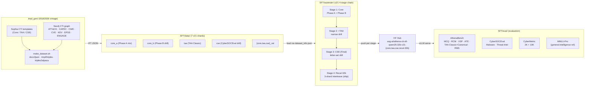
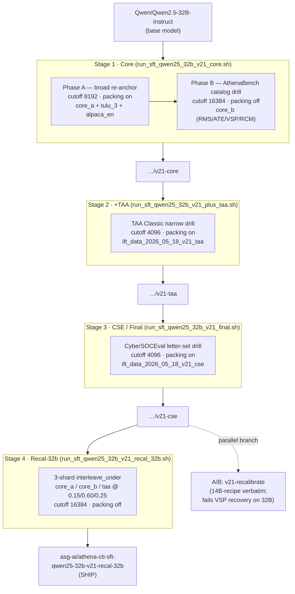

# SFT End-to-End Flow (v21, Qwen-2.5-32B target)

This document is the single-source description of the Glaukopis SFT
pipeline as of the **v21** vintage (May 18, 2026). The canonical
target is **Qwen-2.5-32B-Instruct**; the v21 recipe is also ported
byte-identically to four other bases (Qwen-2.5-14B, Foundation-Sec-8B,
Llama-3.1-8B, Qwen3-30B-A3B-Thinking-2507 MoE). This file complements
[`README.md`](README.md) (quick-start + environment),
[`autotrain/README.md`](autotrain/README.md) (per-launcher flag
reference), and
[`tmpl_gen/templates/05182026/README-21.md`](../tmpl_gen/templates/05182026/README-21.md)
(v21 master plan, sign-off gates, 32B port rationale) by describing
how the three modules fit together — **templates → train → test** —
and what each v21 artifact does.

## High-level pipeline



The chain produces four cumulative HF checkpoints
(`v21-core → v21-taa → v21-cse → v21-recal-32b`); the **`v21-recal-32b`**
Stage 4 variant (32B-tuned LR / Phase-B-heavy interleave) is the ship
checkpoint. A parallel `v21-recalibrate` branch (14B-recipe verbatim
port off the same `v21-cse` parent) is retained as the diagnostic A/B.

---

## 1. Templates — `tmpl_gen/` and the v21 vintage

`tmpl_gen` (see [`../tmpl_gen/README.md`](../tmpl_gen/README.md)) is
the IFT triple generator. Templates are plain-text manifests of CTI
prompts whose placeholders (`{var:NodeType.property}`,
`{var1.rel>TargetType.property}`, `{force …}`, `<* … *>`) are
expanded against an `athena-cti-db` Neo4j instance carrying MITRE
ATT&CK, CAPEC, CWE, CVE, CISA KEV, FIRST EPSS, and MITRE ENGAGE
nodes. The end-to-end build is
[`tmpl_gen/data_generation/make_dataset.sh`](../tmpl_gen/data_generation/make_dataset.sh),
which wraps three steps:

1. `docx2json.sh` — extract templates from `.docx` to JSON (or take
   a manifest `.txt`/`.json` directly).
2. `tmpl2triples.sh` — drive `iftgen.py` per template against the
   CTI graph.
3. `triples2alpaca.sh` — merge per-template triple JSON files into
   one Alpaca-format dataset
   (`instruction` → `system`, `input` → `prompt`, `output` → `response`).

### v21 template vintage — `tmpl_gen/templates/05182026/`

v21 is a `shasum`-verified byte-identical fork of the v18.1 templates
+ gates (see
[`tmpl_gen/templates/05182026/README-21.md`](../tmpl_gen/templates/05182026/README-21.md)
§"What is byte-identical vs v18.1"). The only differences from v18.1
are date stamps, dataset names, build-dir names, and HF push targets
— no `Count:`, `--max-samples`, `--lr`, `--cutoff`, or gate-floor
change. The vintage directory is self-contained:

| File | Role |
|---|---|
| `README-21.md` | Vintage overview, byte-identity audit, Findings block (ship recommendations per architecture), 32B port rationale, Stage-4 recipe split |
| `v21_plan.txt` | Master plan: §1–§6 + §7 (14B outcome) + §8 (32B port and Stage-4 split) |
| `Sophia-CTI-Templates-v21.txt` | Core manifest (Stages 1+2 of the chain). Body byte-identical to `05112026/Sophia-CTI-Templates-v18.1.txt` |
| `Sophia-CTI-Templates-v21_taa.txt` | TAA Classic manifest (Stage 2 / +TAA). Byte-identical to `05092026/Sophia-CTI-Templates-v16.txt` |
| `Sophia-CTI-Templates-v21_cse.txt` | CyberSOCEval letter-set manifest (Stage 3 / Final). Byte-identical to `05102026/Sophia-CTI-Templates-v17.1.txt` |
| `v21_row_count_gate.json` | Per-axis `REJECT_IF_BELOW` thresholds for the Core shard (carried from `v18_1_row_count_gate.json`) |
| `v21_taa_row_count_gate.json` | TAA per-axis floors (carried from `v16_row_count_gate.json`) |
| `v21_cse_row_count_gate.json` | CSE per-axis floors (carried from `v17_1_row_count_gate.json`) |

### Sibling build trees (repo root)

Three `_v21_{core,taa,cse}_build/` directories drive the
post-`make_dataset.sh` pipeline. Each contains:

- `watcher.sh` — runs substrate gate → seed-provenance → generator
  merges → dedup → row-count gate → licence gate → stratified shuffle
  → val/train split → (Core only) two-shard phase split.
- `build_val_slice.py` — per-axis val/train splitter (50 rows /
  shortname, seed=42).
- `_neo4j_check.py` — Phase 0 substrate validator (Core only).
- `letter_balance_gate.py` — CSE letter-tuple distribution gate
  (CSE only).
- `validate_corpus.py` — cross-stage end-to-end validator (Core
  only; spot-checks all three shards).

### v21 dataset shards (final outputs)

All seven shards land in [`SFT/data/`](data/) and are pre-registered
in [`SFT/data/dataset_info.json`](data/dataset_info.json) with the
Alpaca-column mapping LlamaFactory expects.

| Shard | Used by stage | Notes |
|---|---|---|
| `ift_data_2026_05_18_v21_core_a_kb_mcq_taa_soc_cm_ms_yn.json` | Stage 1 (Phase A), Stage 4 | broad re-anchor mix (KB/MCQ/TAA/SOC/CM/MS/YN) |
| `ift_data_2026_05_18_v21_core_b_rms_ate_vsp_rcm.json` | Stage 1 (Phase B), Stage 4 | AthenaBench catalog drill (RMS/ATE/VSP/RCM) |
| `ift_data_2026_05_18_v21_core_val.json` | Stage 1 eval (val_size 0) | per-axis 50 rows / shortname |
| `ift_data_2026_05_18_v21_taa.json` | Stage 2, Stage 4 | TAA Classic narrow drill |
| `ift_data_2026_05_18_v21_taa_val.json` | Stage 2 eval | |
| `ift_data_2026_05_18_v21_cse.json` | Stage 3 | CyberSOCEval letter-set drill |
| `ift_data_2026_05_18_v21_cse_val.json` | Stage 3 eval | |

All `*.json` training files are gitignored; rsync from the build
workstation or regenerate in place (see §2 below). Shards are
template-baked and **architecture-independent**: the same seven JSON
files feed every v21 port (32B / 14B / 8B / MoE).

---

## 2. Building the v21 datasets (from scratch)

Run the three shard builds concurrently. Each lives under its own
`_v21_{core,taa,cse}_build/` tree at the repo root; the `watcher.sh`
enforces the gates and produces the shards listed above. The
`count_limit` / `count_max` args carry over verbatim from v18.1.

```bash
cd /Users/pietro/code/Glaukopis      # or the cluster equivalent

# Stage 1 Core (count_limit=2500, count_max=1500 verbatim from v18.1)
python _v21_core_build/_neo4j_check.py
mkdir -p _v21_core_build/triples
nohup bash tmpl_gen/data_generation/make_dataset.sh \
     tmpl_gen/templates/05182026/Sophia-CTI-Templates-v21.txt \
     _v21_core_build/triples \
     SFT/data/ift_data_2026_05_18_v21_core.raw.json \
     2500 1500 > _v21_core_build/build.log 2>&1 &
echo "PID=$!" > _v21_core_build/build.pid
nohup bash _v21_core_build/watcher.sh > _v21_core_build/watcher.log 2>&1 &

# Stage 2 TAA Classic (count_limit=10, count_max=3500 verbatim from v16)
mkdir -p _v21_taa_build/triples
nohup bash tmpl_gen/data_generation/make_dataset.sh \
     tmpl_gen/templates/05182026/Sophia-CTI-Templates-v21_taa.txt \
     _v21_taa_build/triples \
     SFT/data/ift_data_2026_05_18_v21_taa.raw.json \
     10 3500 > _v21_taa_build/build.log 2>&1 &
echo "PID=$!" > _v21_taa_build/build.pid
nohup bash _v21_taa_build/watcher.sh > _v21_taa_build/watcher.log 2>&1 &

# Stage 3 CSE (count_limit=10, count_max=3500 verbatim from v17.1)
mkdir -p _v21_cse_build/triples
nohup bash tmpl_gen/data_generation/make_dataset.sh \
     tmpl_gen/templates/05182026/Sophia-CTI-Templates-v21_cse.txt \
     _v21_cse_build/triples \
     SFT/data/ift_data_2026_05_18_v21_cse.raw.json \
     10 3500 > _v21_cse_build/build.log 2>&1 &
echo "PID=$!" > _v21_cse_build/build.pid
nohup bash _v21_cse_build/watcher.sh > _v21_cse_build/watcher.log 2>&1 &
```

Validate end-to-end with `python _v21_core_build/validate_corpus.py`.

---

## 3. Train — the v21 chain (Qwen-2.5-32B-Instruct)

Four sequential launchers under [`autotrain/`](autotrain/). Each
consumes the prior stage's pushed HF checkpoint as its base; only
each stage's final merged checkpoint is pushed (no intermediate
shards uploaded). All four wrap
[`utils/run_train.sh`](utils/run_train.sh) → `llamafactory-cli train`
with DeepSpeed ZeRO-3 and bf16, source `SFT/.env` for
`HF_TOKEN`/`HF_USERNAME`, and accept `--dry-run`, `--repo-id`,
`--report-to wandb|none`, and `--offload`/`--no-offload`.

### Stage components



### Per-stage SFT parameters (Qwen-2.5-32B-Instruct)

| # | Launcher | Datasets (LF names) | Cutoff | Pack | LR | eff_bs | Save/eval | Optimizer | GC | Offload | Base → push |
|---:|---|---|---:|---|---:|---:|---:|---|---|---|---|
| 1 | `run_sft_qwen25_32b_v21_core.sh` **Phase A** | `ift_data_2026_05_18_v21_core_a_kb_mcq_taa_soc_cm_ms_yn` + `tulu_3_sft_mixture` + `alpaca_en_demo` | 8192 | on | 1e-5 | 16 | 500 | adamw_8bit | on | on (auto) | `Qwen/Qwen2.5-32B-Instruct` → (intermediate) |
| 1 | `run_sft_qwen25_32b_v21_core.sh` **Phase B** | `ift_data_2026_05_18_v21_core_b_rms_ate_vsp_rcm` | 16384 | off | 5e-6 | 8 | 400 | adamw_8bit | on | on (auto) | Phase A dir → `…/v21-core` |
| 2 | `run_sft_qwen25_32b_v21_plus_taa.sh` | `ift_data_2026_05_18_v21_taa` | 4096 | on | 5e-6 | 16 | 100 | adamw_8bit | on | on (auto) | `…/v21-core` → `…/v21-taa` |
| 3 | `run_sft_qwen25_32b_v21_final.sh` (CSE) | `ift_data_2026_05_18_v21_cse` | 4096 | on | 5e-6 | 16 | 100 | adamw_8bit | on | on (auto) | `…/v21-taa` → `…/v21-cse` |
| 4 | **`run_sft_qwen25_32b_v21_recal_32b.sh`** (ship) | `core_a` (0.15) + `core_b` (0.60) + `taa` (0.25), `interleave_under`, `--max-samples 3600` | 16384 | off | **3e-6** | 8 | 200 | adamw_8bit | on | on | `…/v21-cse` → `…/v21-recal-32b` |
| 4 | `run_sft_qwen25_32b_v21_recalibrate.sh` (A/B; 14B-recipe) | `core_a` (0.25) + `core_b` (0.40) + `taa` (0.35), `interleave_under`, `--max-samples 2400` | 16384 | off | 1e-6 | 8 | 200 | adamw_8bit | on | on | `…/v21-cse` → `…/v21-recalibrate` |

Shared across every stage: `--enable_liger_kernel True`,
`--deepspeed ds_z3_offload_config.json` (offload-on) or
`ds_z3_config.json` (offload-off), `--save_total_limit 2`,
`--save_only_model True`, bf16, `FORCE_TORCHRUN=1`,
`PYTORCH_CUDA_ALLOC_CONF=expandable_segments:True`. Effective batch
is held by auto-scaling `grad_accum` to GPU count
(`A_GA = 16 / (1 × GPUs)` etc.); 8×H100 SXM is the only supported
topology (the recipe warns and continues at other counts).

### Chained execution — `run_sft_qwen25_32b_v21_chain.sh`

Stages 2 → 3 → 4 can be run as a single unattended job via the
chain wrapper. Each stage launches its own per-stage script
unchanged (same output dirs, same per-stage train.log, same HF
push); the wrapper adds (a) sequential execution gated on the prior
stage's non-zero exit halting the chain, and (b) a pre-stage
HF-readability probe so a silent push failure does not waste the
next stage's compute. Aggregate log lives at
`SFT/saves/qwen25_32b_v21_chain_<ts>/chain.log`; per-stage stdout
is teed to
`SFT/saves/qwen25_32b_v21_chain_<ts>/<stage>.log`.

```bash
# Default: TAA -> CSE -> Recalibrate (14B-recipe).
# NOTE: the chain invokes the 14B-recipe v21-recalibrate variant for
# parity with the 14B chain; the ship-grade v21-recal-32b is run
# standalone off v21-cse (see "Per-stage notes" below).
./run_sft_qwen25_32b_v21_chain.sh

# Stop at v21-cse and run the ship Stage-4 variant standalone.
./run_sft_qwen25_32b_v21_chain.sh --stop-stage cse
./run_sft_qwen25_32b_v21_recal_32b.sh

# Full chain including Stage 1.
./run_sft_qwen25_32b_v21_chain.sh --include-core

# Resume from a partial run.
./run_sft_qwen25_32b_v21_chain.sh --start-stage cse           # 3 -> 4
./run_sft_qwen25_32b_v21_chain.sh --start-stage recalibrate   # 4 only

# Forward common knobs to every stage.
./run_sft_qwen25_32b_v21_chain.sh --report-to none --no-offload

# Recalibrate-specific knobs (forwarded only to Stage 4).
./run_sft_qwen25_32b_v21_chain.sh --probs 0.25,0.40,0.35 --max-samples 2400 --lr 1e-6
```

### Per-stage notes (rationale and gotchas)

- **Stage 1 (Core)** runs both phases back-to-back inside the single
  `run_sft_qwen25_32b_v21_core.sh` launcher. Phase A is the broad
  re-anchor (packed, cutoff 8192); Phase B is the AthenaBench
  catalog drill (unpacked, cutoff 16384). Only Phase B's merged
  checkpoint is pushed. At 32B `--gc` defaults to `on` (the 14B
  "auto-disable on 8×H100" branch leaves no margin for the o_proj
  backward temp at the doubled weight footprint). `--skip-eval` is
  the targeted Phase B OOM mitigation; eval is monitoring-only (no
  `load_best_model_at_end`).

- **Stage 2 (+TAA)** is byte-identical to the 14B v21+TAA recipe.
  Only the base-model pointer (now `…/v21-core` at 32B) and HF push
  target change; templates and dataset are architecture-independent.
  Gradient checkpointing held on at 32B regardless of GPU count.

- **Stage 3 (CSE / Final)** is the CyberSOCEval letter-set drill.
  Recipe parity with the 14B v21 final. The Stage 3 → 3.5 trade-off
  is real on 32B too: VSP drops from 82.5 → 78.9 against the CSE
  axis lift; the off-plan Stage 4 recovers it.

- **Stage 4 (Recal-32b — ship)** is a 3-shard `interleave_under`
  touch-up. At 32B the 14B recipe (1e-6 LR, 0.25/0.40/0.35,
  `--max-samples 2400`) sits at the `adamw_8bit` optimizer noise
  floor and drifts VSP the wrong way (78.9 → 75.7). The 32B-tuned
  recipe lifts LR to 3e-6 (~3× param ratio) and shifts the mix to
  Phase-B-heavy (0.15/0.60/0.25) at `--max-samples 3600` to expose
  more VSP/RMS catalog per interleaved row; the interleave_under cap
  is held at 6000 rows (≈ 1500 optimizer steps, ~3–4 h on 8×H100
  SXM) so step count and wall-time are constant — only the
  catalog-recovery recipe varies. Intra-training eval is **disabled**
  (LlamaFactory requires `len(eval_dataset) == len(interleave_probs)`,
  and the three natural eval shards would dedupe to two; sign-off is
  via the post-train bench sweep — see §4).

- **Stage 4 (Recalibrate — A/B)** retains the 14B recipe verbatim on
  the 32B base. Kept on disk as the recipe-provenance A/B against
  `v21-recal-32b`; both branches share `v21-cse` as parent.

### Wall-time budget (Qwen-2.5-32B on 8×H100 80GB SXM)

4×H100 is **not** supported at 32B — the ZeRO-3 weight shard doubles
to ~16 GB/rank and exceeds the per-rank activation budget at every
stage. 8×H200 141GB and 8×RTX PRO 6000 96GB are supported as
alternative topologies (see per-launcher headers for the
PCIe-vs-NVLink overhead deltas).

| Stage | 8×H100 80GB SXM | 8×H200 141GB SXM | 8×RTX PRO 6000 96GB |
|---|---:|---:|---:|
| Stage 1 — Core (Phase A + Phase B) | ~26–30 h | ~22–26 h | ~34–42 h |
| Stage 2 — +TAA | ~13–17 h | ~11–14 h | ~17–22 h |
| Stage 3 — CSE (Final) | ~9–13 h | ~8–11 h | ~13–18 h |
| Stage 4 — Recal-32b (ship) | ~3–4 h | ~2–3 h | ~4–6 h |
| Stage 4 — Recalibrate (A/B) | ~3–4 h | ~2–3 h | ~4–6 h |
| **Total (Core → Recal-32b)** | **~51–64 h** | **~43–54 h** | **~68–88 h** |

Phase B and Stage 4 are the bottlenecks (both run at cutoff 16384
packing-off). The wall-time tables in each launcher's header carry
the full topology breakdown.

### Ported variants — wall-times

The v21 recipe applies byte-identically (datasets, cutoff, packing,
LR, eff_bs, save/eval cadence) to the other ported bases; only the
`--model` pointer, HF push targets, and per-architecture memory
flags (e.g. `adamw_8bit` mandatory at 32B) differ.

| Architecture | Stage launchers prefix | Ship checkpoint | End-to-end wall-time (best topology) |
|---|---|---|---:|
| Qwen-2.5-32B-Instruct (canonical) | `run_sft_qwen25_32b_v21_*` | `v21-recal-32b` | ~51–64 h (8×H100 SXM) |
| Qwen-2.5-14B-Instruct | `run_sft_qwen25_14b_v21_*` | `v21-recalibrate` | ~24 h + ~95 min (8×H100 / 4×H100 split) |
| Foundation-Sec-8B | `run_sft_foundation_8b_v21_*` | `v21-recalibrate` | ~14 h (4×H100) |
| Llama-3.1-8B-Instruct | `run_sft_llama31_8b_v21_*` | `v21-recalibrate` | ~14 h (4×H100) |
| Qwen3-30B-A3B-Thinking-2507 (MoE) | `run_sft_qwen3_30b_a3b_thinking_v21_*` | `v21-cse` (Stage 4 closed) | ~28–37 h (8×B300) / ~55–75 h (8×H100) |

### Where outputs land

- Training writes to `SFT/saves/Qwen_Qwen2.5-32B-Instruct/full/v21_<stage>_<ts>/`
  with intermediate checkpoints every `save_steps`,
  `save_total_limit 2`, `save_only_model True`.
- On exit 0 the launcher merges and uploads via
  [`scripts/upload_to_hf.py`](scripts/upload_to_hf.py) to
  `${HF_USERNAME}/athena-cti-sft-qwen25-32b-v21-{core,taa,cse,recal-32b,recalibrate}`.
- `train_config.json` (effective flags + git sha) and `train.log`
  (tee'd stdout/stderr) are written to the same output dir.

---

## 4. Test — benchmark sweeps

The pushed checkpoints are evaluated via the
[`test/`](test/README.md) pipeline against four suites:
**AthenaBench** (6 tasks: MCQ, RCM, VSP, ATE, TAA Classic + Canonical,
RMS), **CyberSOCEval** (Malware-analysis, Threat-Intel-Reasoning),
**CyberMetric** (2K + 10K), and **MMLU-Pro** (general-intelligence
reference, decoupled from CTI scoring).

### Evaluation flow

```mermaid
flowchart LR
    HF["HF Hub<br/>asg-ai/athena-cti-sft-<br/>qwen25-32b-v21-recal-32b"]
    subgraph SVR["vLLM serving (test/utils/serve_vllm.sh)"]
        V1["OpenAI-compatible server<br/>localhost:8000 · tp=2 (2xH100)<br/>--reasoning-parser per arch"]
    end
    subgraph BENCH["run_benchmark.sh / serve_and_bench_*"]
        B1["AthenaBench<br/>--suite athena<br/>MCQ · RCM · VSP · ATE ·<br/>TAA Classic+Canonical · RMS"]
        B2["CyberSOCEval<br/>--suite cybersoceval<br/>Malware · Threat-Intel"]
        B3["CyberMetric<br/>--suite cybermetric<br/>2K + 10K"]
        B4["MMLU-Pro<br/>serve_and_bench_mmlu_pro.sh<br/>(general-intelligence ref)"]
    end
    subgraph COST["Cost tracking (pipelines/api_usage.py)"]
        C1["per-task token<br/>+ wallclock capture"]
        C2["api_usage_checkpoint.json<br/>(resume across runs)"]
        C3["build_cost_summary.py"]
        C4["responses/cost_summary.csv<br/>API $/1K tok · vLLM $/GPU-hr"]
        C1 --> C2 --> C3 --> C4
    end
    HF --> SVR --> BENCH
    BENCH --> RESP["test/responses/&lt;alias&gt;/<br/>response.jsonl + summary_*.json"]
    BENCH -.usage.-> C1
    RESP --> COST
```



### Transports (`pipelines/models.py` alias suffix)

| Alias suffix | Transport | Use when |
|---|---|---|
| `-vllm` | Local vLLM OpenAI-compatible server (`test/utils/serve_vllm.sh`) | Benchmarking private v21 checkpoints; high-throughput |
| `-hf` | HuggingFace Inference Providers (hosted API; `pipelines/api_usage.py` priced per-1K tok) | Large public-model baselines (DeepSeek, Kimi, Gemma, Qwen3.x, GPT-5.x, Gemini-3) |
| *(none)* | Local transformers, `device_map="auto"` | Transport-parity checks; sequential |

```bash
# Two-terminal local vLLM sweep against v21-recal-32b (ship).
conda activate vllm
bash SFT/eval/utils/serve_vllm.sh \
    --model asg-ai/athena-cti-sft-qwen25-32b-v21-recal-32b --tp 2

conda activate ctibench
cd SFT/eval
./utils/run_benchmark.sh athena-cti-sft-qwen25-32b-v21-recal-32b-vllm \
    --suite athena --batch 64 --version 1
./utils/run_benchmark.sh athena-cti-sft-qwen25-32b-v21-recal-32b-vllm \
    --suite cybersoceval --batch 64
./utils/run_benchmark.sh athena-cti-sft-qwen25-32b-v21-recal-32b-vllm \
    --suite cybermetric --cybermetric-size 2000,10000 --batch 64

# Or the all-in-one wrapper (one warm vLLM session; ~11 h end-to-end on 2xH100):
bash SFT/eval/utils/serve_and_bench_qwen25_32b_v21_recal_32b.sh

# MMLU-Pro is benched in a separate session so suite scope stays decoupled:
bash SFT/eval/utils/serve_and_bench_mmlu_pro.sh \
    athena-cti-sft-qwen25-32b-v21-recal-32b-vllm
```

### Cost tracking

`pipelines/api_usage.py` carries the per-1K-token rate card for hosted
models (DeepSeek-V3.2/V4, Gemini-2.5/3-Flash, GPT-5.x); the HF Router
path in `pipelines/models.py::HFInferenceModel.generate` captures
`response.usage` and calls `add_tokens()`, which is checkpointed to
`responses/api_usage_checkpoint.json` on every successful task
completion (graceful unpriced fallback warns once and charges 0).
Local vLLM rows are billed against wall-clock × $2.50/GPU-hr on the
2×H100 reference host. The aggregator
[`utils/build_cost_summary.py`](test/utils/build_cost_summary.py)
blends both into `responses/cost_summary.csv` (also TSV) with
per-task token totals, GPU-hours, and total USD. The chain wrapper
[`utils/run_cost_revalidation_chain.sh`](test/utils/run_cost_revalidation_chain.sh)
re-benches a configurable baseline set under the cost-instrumented
stack for clean wall-clock numbers; resume is alias-keyed
(per-`(task, model, version)` cells skipped when `--mode resume`).

### v21 ship sign-off gates (`tmpl_gen/templates/05182026/README-21.md` Findings)

The `v21-cse` 32B sign-off held inside the §5.1 v18.1 ±1.5pp band on
Total Score (65.8 vs target band); the Stage-4 `v21-recal-32b`
variant then lifted Total to **65.0 / Weighted 62.9** under the 50/50
TAA blend (Classic + Canonical combined; introduced 2026-05-22 for
cross-architecture ranking). This is the v21 vintage's optimal ship
checkpoint across all ported architectures (tops 14B v21-recalibrate
at 61.0, 8B Foundation-Sec / Llama-3.1 v21-recalibrate at 53.5 / 49.8,
and the Qwen3-MoE `v21-cse` at 63.4 / 60.9).

### Falsification

If a fresh v21 chain misses the 50/50 TAA blend Total ≥ 62.9 on
Stage 4, the residual gap implicates the data-build non-determinism
diagnosed in `tmpl_gen/templates/05182026/README-21.md` §"Findings
→ Interpretation" (substrate sampling / dedup tiebreaks / shuffle
seeding in `make_dataset.sh`). The next vintage should pin Neo4j
read order and seed the substrate sampler before another
reproducibility run.

---

## 5. Lineage — why v21 is the current target

v21 is the **strict-reproducibility experiment** on top of v18.1,
extended by an off-plan Stage 4 (Recalibrate) and a 32B port. Three
phases of evolution from v18.1:

1. **`shasum`-verified byte-identity vs v18.1** (templates, gate
   JSONs, count limits, recipe). The §5.1 sign-off was that v21-core
   would land within ±1.5 pp of v18.1-core on every axis. **Total**
   landed in-band; **per-axis ATE/RCM** drifted outside it, with
   the same shape v19 and v20 showed — implicating data-build
   non-determinism in `make_dataset.sh` rather than recipe drift.
2. **Off-plan Stage 4 (Recalibrate)** lifted 14B VSP from 72.9 (post-
   CSE) back to 83.1 and produced the 14B ship at Total 61.0
   (vs `v21-core` 60.8). Moved onto the default chain path for parity.
3. **Qwen-2.5-32B port** + **Stage-4 recipe split**. Stages 1–3
   carry the 14B recipe verbatim (template-baked datasets are
   architecture-independent); only the base-model pointer, HF push
   targets, and 32B-mandatory memory flags (`adamw_8bit`, GC-on,
   offload-on-default) change. Stage 4 is the only place the 14B
   recipe does not carry: at 32B + `adamw_8bit` the 14B-tuned
   1e-6 / 0.40 Phase-B share sits at the optimizer noise floor and
   regresses VSP (78.9 → 75.7). The **`v21-recal-32b`** variant
   (3e-6 LR, Phase-B-heavy 0.15/0.60/0.25, `--max-samples 3600`)
   recovers VSP and tops the v21 leaderboard at Total 65.0 /
   Weighted 62.9 — the current ship checkpoint across all
   architectures.

Predecessor lineage carried forward: chain topology and per-stage
recipe shapes are v18.1 → v18.2 → v19 → v20 → v21 byte-identical
(only dataset names, HF push targets, the Stage-4 recipe split, and
the 32B memory deltas above change). The v7 Llama-3.1-8B baseline
(62.64 % strict F1 on `athena-rms`) remains the documented pre-v21
8B reference; the v21-recal-32b 32B chain is the documented
production recipe.

---

## 6. File map

```
SFT/
  README.md                       quick-start + environment
  SFT_FLOW.md                     this document
  .env.example                    HF_TOKEN / HF_USERNAME / WANDB / GITHUB_TOKEN
  utils/
    setup.sh                      idempotent installer (conda + envs + git auth)
    run_train.sh                  thin llamafactory-cli wrapper used by every launcher
    cleanup_disk.sh               disk reclaim helper (called by setup.sh)
  autotrain/
    run_sft_qwen25_32b_v21_core.sh         Stage 1 (Phase A + Phase B)            ** ship arch **
    run_sft_qwen25_32b_v21_plus_taa.sh     Stage 2 (TAA)
    run_sft_qwen25_32b_v21_final.sh        Stage 3 (CSE / Final)
    run_sft_qwen25_32b_v21_recal_32b.sh    Stage 4 (Recal-32b — ship variant)
    run_sft_qwen25_32b_v21_recalibrate.sh  Stage 4 (Recalibrate — 14B-recipe A/B)
    run_sft_qwen25_32b_v21_chain.sh        Stage 2 -> 3 -> 4 sequential wrapper
    run_sft_qwen25_14b_v21_*.sh            14B port (4-stage; ships at v21-recalibrate)
    run_sft_foundation_8b_v21_*.sh         Foundation-Sec-8B port
    run_sft_llama31_8b_v21_*.sh            Llama-3.1-8B-Instruct port
    run_sft_qwen3_30b_a3b_thinking_v21_*.sh   Qwen3-30B-A3B-Thinking MoE port (incl. recal_32b)
    run_sft_gemma4_31b_v21_*.sh            Gemma-4-31B port
    run_sft_qwen25_14b_v20_*.sh            v20 lineage (Qwen-2.5-14B; superseded by v21)
    run_abaligned_sft_v7.sh                Llama-3.1-8B v7 baseline (legacy)
    run_abaligned_sft_qwen25_14b_v{7,8,8small,81,9,10}.sh   pre-v11 lineage
    run_sft_qwen25_14b_v{11..19}*.sh       v11..v19 lineage
    README.md                              per-launcher flag reference
    model_cards/                           HF model-card seeds
  data/
    ift_data_2026_05_18_v21_*.json         v21 shards: core_a, core_b, taa, cse (gitignored)
    ift_data_2026_05_16_v20_*.json         v20 shards (superseded)
    dataset_info.json                      LlamaFactory dataset registry
  scripts/
    upload_to_hf.py                        merge + push helper (called on exit 0)
    vllm_infer.py                          local vLLM batch inference
  test/
    README.md                              eval + transport reference
    utils/
      run_benchmark.sh                     sweep launcher (per-suite)
      serve_vllm.sh                        local vLLM server
      serve_and_bench_*.sh                 one-shot warm-serve + sweep wrappers
      serve_and_bench_mmlu_pro.sh          MMLU-Pro reference sweep
      run_cost_revalidation_chain.sh       baseline re-bench under cost instrumentation
      build_cost_summary.py                blends API + vLLM costs into cost_summary.csv
    pipelines/
      models.py                            alias → repo registry (`-vllm`, `-hf` suffixes)
      api_usage.py                         HF Router cost / usage tracking + checkpoint
      inference.py                         is_billable_api gate + success-path checkpointing
    responses/
      <alias>/response.jsonl + summary_*.json   per-(task, model, version) cells
      api_usage_checkpoint.json            resume-state for API token + USD totals
      cost_summary.{csv,tsv}               aggregated billing view

tmpl_gen/
  README.md                                template syntax + iftgen.py
  data_generation/
    make_dataset.sh                        docx2json → tmpl2triples → triples2alpaca
  templates/
    README.md                              category / source / design strategy
    05182026/                              ** v21 vintage (current target) **
      README-21.md
      v21_plan.txt
      Sophia-CTI-Templates-v21_{core,taa,cse}.txt
      v21{,_taa,_cse}_row_count_gate.json
    05162026/                              v20 vintage (superseded)

_v21_core_build/                           Stage 1 build pipeline (root)
_v21_taa_build/                            Stage 2 build pipeline (root)
_v21_cse_build/                            Stage 3 build pipeline (root)
```

