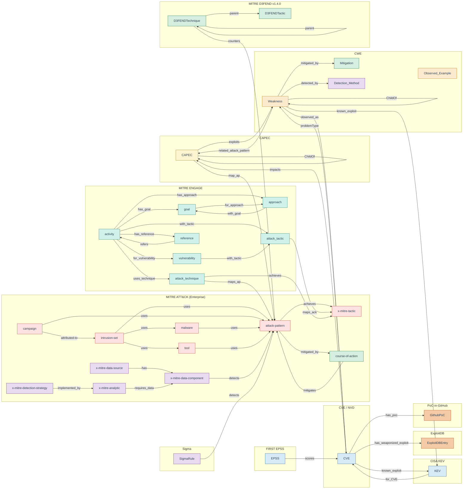

# Athena CTI DB — Functional Scope

This document describes the **functional footprint** of the Athena CTI graph database: the data sources ingested, the entity types modelled, and the relationships embedded in the graph. It is the upstream substrate that [`tmpl_gen`](../tmpl_gen/) traverses to generate the SFT instruction-fine-tuning corpus.

For installation, Neo4j configuration, and operator runbook see [`README_LOCAL_SETUP.md`](README_LOCAL_SETUP.md). All ingestion logic referenced below lives in [`threat_framework/populate_neo4j_complete.py`](threat_framework/populate_neo4j_complete.py).

---

## 1. Pipeline Position

```
   ┌────────────────────────┐    ┌───────────────────┐    ┌───────────────┐
   │ Public CTI sources     │───▶│ athena_cti_db     │───▶│ tmpl_gen      │───▶ SFT corpus
   │ (12 sources, see §3)   │    │ (Neo4j graph)     │    │ (traversal +  │     (JSON IFT
   │                        │    │                   │    │  generation)  │      datasets)
   └────────────────────────┘    └───────────────────┘    └───────────────┘
```

The CTI graph is the **single source of truth** for every fact that can appear in an Athena SFT example. Templates in `tmpl_gen` are graph queries dressed as natural-language Q/A pairs; if a fact is not in the graph, it cannot enter training.

---

## 2. Visual Schema

The diagram below summarises the functional scope of the graph: every framework loaded by `populate_neo4j_complete.py`, the principal node label(s) it contributes, and the edges that bind them together. Subgraph clusters correspond to the 12 data sources in §3; intra-framework edges stay inside a cluster, cross-framework bridges cross between them. Edge labels match the Cypher relationship types created by the populator (see §5 for the exhaustive inventory).

Colour key: red = ATT&CK offensive, yellow = CAPEC, orange = CWE, blue = CVE/KEV/EPSS vulnerability surface, green = defensive (D3FEND, course-of-action, mitigation), purple = detection (Sigma, ATT&CK data sources/analytics/detection-strategies), peach = weaponised exploits / PoCs, teal = ENGAGE adversary-engagement.



> The diagram is intentionally pruned to the principal edges per cluster; the complete enumeration (including STIX `relationship_type` variants and ENGAGE-internal edges) lives in §5.

---

## 3. Data Sources

12 public sources are ingested. Each is downloaded into `threat_data/<dir>/` and re-used on subsequent runs (skip-if-cached). All URLs and download mechanics are defined in `populate_neo4j_complete.py::DATA_SOURCES` and `download_and_extract_data()`.

| # | Source | Origin | Acquisition | Retention | Primary node labels |
|---|---|---|---|---:|---|
| 1 | **MITRE ATT&CK** (Enterprise) | `github.com/mitre/cti.git` | Full git clone; STIX 2.1 JSON | full | `attack-pattern`, `x-mitre-tactic`, `campaign`, `course-of-action`, `intrusion-set`, `malware`, `tool`, `x-mitre-data-source`, `x-mitre-data-component`, `x-mitre-analytic`, `x-mitre-detection-strategy` |
| 2 | **MITRE ENGAGE** | `github.com/mitre/engage.git` | Full git clone; per-entity JSON | full | `goal`, `approach`, `activity`, `vulnerability`, `attack_technique`, `attack_tactic`, `reference` |
| 3 | **MITRE CAPEC** | `capec.mitre.org/data/xml/capec_latest.xml` | HTTPS GET; XML | full | `CAPEC` |
| 4 | **MITRE CWE** | `cwe.mitre.org/data/xml/cwec_latest.xml.zip` | HTTPS GET (zip) → recursive extract | full | `Weakness`, `Detection_Method`, `Mitigation`, `Observed_Example` |
| 5 | **MITRE D3FEND** | `d3fend.mitre.org/ontologies/d3fend/{ver}/d3fend.json` + `…/d3fend-full-mappings.json` | HTTPS GET; JSON-LD + SPARQL-JSON | pinned **v1.4.0** | `D3FENDTactic`, `D3FENDTechnique` |
| 6 | **CVE Project (CVE 5.0)** | `github.com/CVEProject/cvelistV5.git` | Sparse-clone of `cves/{year}/` | **2024+** only | `CVE` |
| 7 | **NVD CPE/CVSS feeds** | `nvd.nist.gov/feeds/json/cve/2.0` | HTTPS GET (gzip per year) | **2024+** | *no node* — folded into `CVE.cpe_matches` |
| 8 | **CISA KEV** | `cisa.gov/.../known_exploited_vulnerabilities.json` | HTTPS GET; JSON feed | full | `KEV` |
| 9 | **FIRST EPSS** | `epss.cyentia.com/epss_scores-{date}.csv.gz` | HTTPS GET (yesterday's snapshot) | **2024+** rows | `EPSS` |
| 10 | **Sigma rules** | `github.com/SigmaHQ/sigma.git` | Sparse-clone of `rules/` | full ruleset | `SigmaRule` |
| 11 | **ExploitDB** | `gitlab.com/exploit-database/exploitdb.git` | Sparse-clone of `files_exploits.csv` | rows w/ **2024+** CVE | `ExploitDBEntry` |
| 12 | **PoC-in-GitHub** | `github.com/nomi-sec/PoC-in-GitHub.git` | Sparse-clone of `202*/` year folders | **2024+** | `GithubPoC` |

**Date scoping rationale.** CVE/NVD/EPSS/ExploitDB/PoC are restricted to 2024+ to keep the graph at working size (~2-3 M nodes vs. ~10 M+ for full history) while preserving the modern threat surface that Athena is trained to reason about. ATT&CK, CAPEC, CWE, KEV, ENGAGE, D3FEND, and Sigma are loaded in full because the catalogues themselves are bounded.

**License posture.** All twelve sources are public and redistribution-friendly: MITRE corpora (ATT&CK/CAPEC/CWE/D3FEND/ENGAGE) are CC BY 4.0; CVE Project is CC0; NVD is US-Gov public domain; CISA KEV is US-Gov public domain; FIRST EPSS is CC BY-SA 4.0; Sigma is DRL 1.1 (Detection Rule License); ExploitDB is GPL-2.0; PoC-in-GitHub is MIT. Provenance is preserved in node URLs and external_references.

---

## 4. Node Inventory (Graph Schema)

The unique-key constraints created in `create_constraints()` define the canonical entity set:

### 4.1 ATT&CK / STIX (11 labels)
| Label | Key | Source field | Notes |
|---|---|---|---|
| `attack-pattern` | `stix_id` | STIX `id` | ATT&CK Techniques (T-codes via `mitre_id`) |
| `x-mitre-tactic` | `stix_id` | STIX `id` | ATT&CK Tactics (TA-codes); `x_mitre_shortname` used for kill-chain joins |
| `campaign` | `stix_id` | STIX `id` | Named adversary campaigns |
| `course-of-action` | `stix_id` | STIX `id` | ATT&CK Mitigations (M-codes) |
| `intrusion-set` | `stix_id` | STIX `id` | Threat actors / APT groups (G-codes) |
| `malware` | `stix_id` | STIX `id` | ATT&CK Software / malware (S-codes) |
| `tool` | `stix_id` | STIX `id` | ATT&CK Software / tools (S-codes) |
| `x-mitre-data-source` | `stix_id` | STIX `id` | DS-codes |
| `x-mitre-data-component` | `stix_id` | STIX `id` | DC-codes |
| `x-mitre-analytic` | `stix_id` | STIX `id` | New ATT&CK 17.x analytic objects |
| `x-mitre-detection-strategy` | `stix_id` | STIX `id` | New ATT&CK 17.x detection-strategy objects |

### 4.2 CWE / CAPEC / CVE / KEV / EPSS (8 labels)
| Label | Key | Notes |
|---|---|---|
| `Weakness` | `id` (e.g. `CWE-79`), `stix_id` | CWE entries |
| `Detection_Method` | `id`, `stix_id` | Deduped across all CWEs by `Detection_Method_ID` |
| `Mitigation` | `id`, `stix_id` | CWE-scoped (`{weakness_id}_{mit_id}`) since `MIT-1` repeats across CWEs |
| `Observed_Example` | `id`, `stix_id` | CWE→CVE references (deduped by reference) |
| `CAPEC` | `stix_id` | `id`/`capec_id` carry the numeric CAPEC ID |
| `CVE` | `id` (e.g. `CVE-2024-12345`), `stix_id` | Includes inline `cpe_matches` (from NVD) and CVSS v3.1 scalars |
| `KEV` | `stix_id` | One per CISA-listed CVE |
| `EPSS` | `stix_id` | Daily score snapshot per CVE |

### 4.3 ENGAGE (7 labels) — adversary-engagement (deception/denial) framework
`goal`, `approach`, `activity`, `vulnerability`, `attack_technique`, `attack_tactic`, `reference` — all keyed on `stix_id`.

### 4.4 Detection / Defense / Exploitation extensions (5 labels)
| Label | Key | Notes |
|---|---|---|
| `SigmaRule` | `id`, `stix_id` | UUID rule id; `tags` parsed for ATT&CK linkage |
| `D3FENDTactic` | `d3fend_id`, `stix_id` | Synthesized from canonical 7-tactic list (`Model`/`Harden`/`Detect`/`Isolate`/`Deceive`/`Evict`/`Restore`) |
| `D3FENDTechnique` | `d3fend_id`, `stix_id` | `~500` techniques carrying `d3f:d3fend-id` |
| `ExploitDBEntry` | `id` (e.g. `EDB-12345`), `stix_id` | Weaponized exploits |
| `GithubPoC` | `id` (e.g. `POC-org-repo`), `stix_id` | Community proof-of-concept repos |

**Identity convention.** Every node has a `stix_id` of form `<framework>--<uuid5>` (deterministic — see `generate_stix_id()`), so re-runs of the populator are idempotent and do not produce duplicates. Native frameworks (ATT&CK/STIX) keep their own UUIDs; synthetic frameworks (CAPEC, CWE, CVE, KEV, EPSS, ENGAGE, D3FEND, Sigma, ExploitDB, PoC) get UUIDv5 derived from their natural ID under a per-framework namespace.

---

## 5. Relationship Inventory

All edges are created by Cypher `MERGE` statements (idempotent). Relationship types preserve the source vocabulary verbatim where possible (e.g. STIX `relationship_type`, CAPEC/CWE `Nature`); custom edges use snake_case names declared in this document.

### 5.1 ATT&CK intra-framework

**STIX-derived (from `enterprise-attack/relationship/*.json`).** The original STIX `relationship_type` is used as the Neo4j edge type for every (source, target) pair where both endpoints are in the supported `type_map` (see `process_attack_relationships()`). Edge properties: `created`, `modified`, `description`, `relationship_type`, `x_mitre_deprecated`. Common types observed in ATT&CK 17.x:

| Edge | Typical endpoints |
|---|---|
| `uses` | `intrusion-set`/`campaign`/`malware`/`tool` → `attack-pattern`/`malware`/`tool` |
| `mitigates` | `course-of-action` → `attack-pattern` |
| `detects` | `x-mitre-data-component` → `attack-pattern` |
| `subtechnique-of` | `attack-pattern` → `attack-pattern` |
| `attributed-to` | `campaign` → `intrusion-set` |
| `revoked-by` | any → any |

**Derived (custom, not in STIX files).** Generated post-load from node properties:

| Edge | Source property | Function |
|---|---|---|
| `(attack-pattern)-[:achieves]->(x-mitre-tactic)` | `attack-pattern.kill_chain_phases[].phase_name` matched to `x-mitre-tactic.x_mitre_shortname` (kill_chain_name=`mitre-attack`) | `create_achieves_relationships()` |
| `(attack-pattern)-[:mitigated_by]->(course-of-action)` | inverse of `mitigates` | `create_mitigated_by_relationships()` |
| `(x-mitre-analytic)-[:requires_data]->(x-mitre-data-component)` | `analytic.x_mitre_log_source_references[].x_mitre_data_component_ref` | `create_custom_attack_relationships()` |
| `(x-mitre-detection-strategy)-[:implemented_by]->(x-mitre-analytic)` | `detection_strategy.x_mitre_analytic_refs[]` | `create_custom_attack_relationships()` |

### 5.2 CAPEC intra-framework

| Edge | Source |
|---|---|
| `(CAPEC)-[:ChildOf]->(CAPEC)` | `Related_Attack_Patterns/@Nature=ChildOf` |
| `(CAPEC)-[:CanPrecede]->(CAPEC)` | `Related_Attack_Patterns/@Nature=CanPrecede` |
| `(CAPEC)-[:PeerOf]->(CAPEC)` | `Related_Attack_Patterns/@Nature=PeerOf` |

### 5.3 CWE intra-framework

| Edge | Source |
|---|---|
| `(Weakness)-[:ChildOf\|CanPrecede\|PeerOf]->(Weakness)` | `Related_Weaknesses/@Nature` (filtered to those three values) |
| `(Weakness)-[:mitigated_by]->(Mitigation)` | `Potential_Mitigations/Mitigation` |
| `(Weakness)-[:detected_by]->(Detection_Method)` | `Detection_Methods/Detection_Method` |

### 5.4 ENGAGE intra-framework

From `engage/Data/json/activity_details.json`:
| Edge | Meaning |
|---|---|
| `(activity)-[:has_goal]->(goal)` | activity supports a defensive goal |
| `(activity)-[:has_approach]->(approach)` | activity instances an approach |
| `(activity)-[:for_vulnerability]->(vulnerability)` | activity targets an EAV (engagement-adversary-vulnerability) |
| `(activity)-[:uses_technique]->(attack_technique)` | activity exercises an ATT&CK technique |
| `(activity)-[:with_tactic]->(attack_tactic)` | activity scoped to a tactic |
| `(activity)-[:has_reference]->(reference)` | activity citation |

From `approach_details.json`: `(approach)-[:with_goal]->(goal)`, `(approach)-[:for_activity]->(activity)`.

From `goal_approach_mappings.json` + `goal_details.json`: `(goal)-[:for_approach]->(approach)`.

From `attack_mapping.json`: `(attack_technique)-[:for_vulnerability]->(vulnerability)`, `(attack_technique)-[:for_activity]->(activity)`.

From `references.json`: `(reference)-[:refers]->(activity)`.

Within-activity inferred: `(vulnerability)-[:with_tactic]->(attack_tactic)` (cross-product of vulns × tactics inside an activity).

### 5.5 Cross-framework edges

These bind frameworks together and are the primary source of multi-hop reasoning paths consumed by `tmpl_gen`:

| Edge | Bridges | Created by |
|---|---|---|
| `(CAPEC)-[:map_ap]->(attack-pattern)` | CAPEC → ATT&CK | `Taxonomy_Mapping[Taxonomy_Name~ATT&CK]` |
| `(CAPEC)-[:exploits]->(Weakness)` | CAPEC → CWE | `Related_Weaknesses[CWE_ID]` |
| `(Weakness)-[:related_attack_pattern]->(CAPEC)` | CWE → CAPEC | `Related_Attack_Patterns[CAPEC_ID]` |
| `(Weakness)-[:observed_as {description, link}]->(CVE)` | CWE → CVE | CWE `Observed_Examples` + CVE 5.0 `cna.problemTypes[].descriptions[].cweId` |
| `(CVE)-[:problemType]->(Weakness)` | CVE → CWE | CVE 5.0 `cna.problemTypes[].descriptions[].cweId` |
| `(CVE)-[:impacts]->(CAPEC)` | CVE → CAPEC | CVE 5.0 `cna.impacts[].capecId` |
| `(KEV)-[:for_CVE]->(CVE)` and `(CVE)-[:known_exploit]->(KEV)` | KEV ↔ CVE | KEV `cveID` |
| `(Weakness)-[:known_exploit]->(KEV)` | CWE → KEV | KEV `cwes[].cweId` |
| `(EPSS)-[:scores]->(CVE)` | EPSS → CVE | EPSS CSV `cve` column |
| `(SigmaRule)-[:detects]->(attack-pattern)` | Sigma → ATT&CK | rule `tags[]` matching `attack.tNNNN[.SSS]` |
| `(D3FENDTechnique)-[:counters {def_tactic, def_artifact, def_artifact_rel, off_artifact, off_artifact_rel}]->(attack-pattern)` | D3FEND → ATT&CK | `d3fend-full-mappings.json` SPARQL bindings |
| `(D3FENDTechnique)-[:parent]->(D3FENDTechnique\|D3FENDTactic)` | D3FEND hierarchy | `rdfs:subClassOf` |
| `(CVE)-[:has_weaponized_exploit]->(ExploitDBEntry)` | CVE → ExploitDB | CSV `codes` field |
| `(CVE)-[:has_poc]->(GithubPoC)` | CVE → PoC repo | filename = CVE id |

ENGAGE → ATT&CK bridges:
| Edge | Source |
|---|---|
| `(attack_tactic)-[:maps_ack]->(x-mitre-tactic)` | ENGAGE tactic id (TA-code) matched to ATT&CK `mitre_id` |
| `(attack_technique)-[:maps_ap]->(attack-pattern)` | ENGAGE `attack_id` (T-code) → ATT&CK `mitre_id` |
| `(attack_technique)-[:achieves]->(x-mitre-tactic)` | per `attack_tactics_techniques.json` |

---

## 6. Quantitative Footprint (typical, 2026-Q2)

Approximate populated counts after a fresh end-to-end run (varies with upstream releases):

| Layer | Nodes | Edges |
|---|---:|---:|
| ATT&CK Enterprise | ~3.5 K | ~25 K |
| CAPEC | ~600 | ~3 K (intra + cross) |
| CWE | ~1.8 K Weakness + ~1 K Mitigation + ~400 Detection_Method | ~10 K |
| CVE (2024+) | ~110 K | ~250 K (problemType + impacts + observed_as) |
| KEV | ~1.4 K | ~3 K |
| EPSS (2024+) | ~110 K | ~110 K |
| ENGAGE | ~250 (all 7 labels combined) | ~1.5 K |
| Sigma | ~3 K rules | ~5 K detects |
| D3FEND v1.4.0 | ~500 techniques + 7 tactics | ~14 K counters + ~600 parent |
| ExploitDB (2024+) | ~5 K entries | ~5 K has_weaponized_exploit |
| PoC-in-GitHub (2024+) | ~50 K repos | ~50 K has_poc |
| **Total (order of magnitude)** | **~280 K nodes** | **~480 K edges** |

These figures are not gates; they are what a healthy populated DB looks like at the time of writing.

---

## 7. How `tmpl_gen` Consumes the Graph

Each axis in the SFT corpus (RMS, TAA, ATE, VSP, RCM, SOC, …) corresponds to a family of graph queries against this schema. Representative paths:

- **RMS (Mitigation Reasoning)** — `(attack-pattern)-[:mitigated_by]->(course-of-action)` and `(Weakness)-[:mitigated_by]->(Mitigation)`; CWE phases / strategies; `D3FENDTechnique-[:counters]->attack-pattern`.
- **TAA (Threat Actor Analysis)** — `(intrusion-set)-[:uses]->(attack-pattern|malware|tool)` plus `(campaign)-[:attributed-to]->(intrusion-set)`; aliases and `x_mitre_aliases`.
- **ATE (ATT&CK Technique Enumeration)** — `attack-pattern` properties + `kill_chain_phases` + `(attack-pattern)-[:achieves]->(x-mitre-tactic)`.
- **VSP (Vulnerability/Software/Product)** — `(CVE)-[:problemType]->(Weakness)`, `CVE.affected_products`, `CVE.cpe_matches` (NVD-derived), `(EPSS)-[:scores]->(CVE)`, `(CVE)-[:known_exploit]->(KEV)`.
- **RCM (Risk/Consequence Modeling)** — `CAPEC.consequences`, `CAPEC.severity`, `CAPEC.likelihood_of_attack` joined to `(CVE)-[:impacts]->(CAPEC)`.
- **SOC (Detection Engineering)** — `(SigmaRule)-[:detects]->(attack-pattern)`, `(x-mitre-data-component)-[:detects]->(attack-pattern)`, `(x-mitre-detection-strategy)-[:implemented_by]->(x-mitre-analytic)-[:requires_data]->(x-mitre-data-component)`.
- **CSE-TI (CyberSOCEval Threat-Intel multi-select)** — same `(intrusion-set)-[:uses]->(attack-pattern)` and `(campaign)-[:uses]->(attack-pattern)` traversals as TAA, projected into a synthetic intel-report prose context with five lettered options (correct techniques drawn from the anchored entity's `uses` set; distractors drawn unbound from `attack-pattern` with `{force ... != ...}` guards). Output shape is a `{"correct_answers": ["A","C"]}` JSON object wrapped in `<json_object>` tags. Added in v17 (`tmpl_gen/templates/05112026/`); mirrors PurpleLlama's `threat_intel_reasoning` benchmark scaffolding without reusing the upstream sample set.
- **CSE-Malware (CyberSOCEval malware-analysis multi-select)** — `(malware)-[:uses]->(attack-pattern)-[:achieves]->(x-mitre-tactic)` plus `(intrusion-set)-[:uses]->(malware)` for the group-attribution variant, projected into a synthetic Hybrid-Analysis-style detonation-report JSON context. Output shape is a bare `{"correct_answers": ["A","B"]}` JSON object. Added in v17; mirrors PurpleLlama's `malware_analysis` benchmark scaffolding.

The graph schema is intentionally over-rich relative to any single axis: any axis added later (e.g. an Engage-deception axis) can be expressed without re-ingestion, by writing new template traversals against the same nodes and edges. The CSE-TI / CSE-Malware additions in v17 illustrate the pattern: they introduce **no new node labels and no new relationships** — only new template families and a new output shape projected out of the same `intrusion-set` / `campaign` / `malware` / `attack-pattern` / `x-mitre-tactic` substrate.

---

## 8. Versioning Notes

- **ATT&CK / CAPEC / CWE / KEV / Sigma / ExploitDB / PoC**: latest at clone time (re-clone to refresh).
- **D3FEND**: pinned to `D3FEND_VERSION = "1.4.0"` in `populate_neo4j_complete.py` for reproducibility; bump constant to upgrade.
- **EPSS**: re-downloaded on every populate run (`download_epss_data()` uses *yesterday's* snapshot and overwrites in place).
- **CVE / NVD**: 2024+ cutoff is enforced both at clone time (sparse paths) and at parse time (`filter_cve_files()`, `process_epss_data()` year filter).

To bump the time horizon (e.g. include CVE-2023), edit `filter_cve_files()`, `download_nvd_data()`'s year range, and the sparse-checkout paths in `download_and_extract_data()`. CVE storage scales roughly linearly with year coverage.

