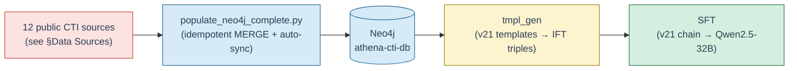

# Athena CTI DB

`athena_cti_db` builds and populates the **Athena Threat Intelligence graph database** on a local Neo4j instance. It ingests **12 public CTI sources** — MITRE ATT&CK, MITRE ENGAGE, MITRE CAPEC, MITRE CWE, MITRE D3FEND, CVE Project (CVE 5.0), NVD CPE/CVSS feeds, CISA KEV, FIRST EPSS, Sigma rules, ExploitDB, and PoC-in-GitHub — modelling all entities and cross-framework relationships in Neo4j.

The populated graph is the **upstream substrate** for [`tmpl_gen`](../tmpl_gen/), which traverses it to generate the Instruction Fine-Tuning (IFT) corpus consumed by the [`SFT`](../SFT/) pipeline. Every fact that can appear in an Athena SFT example must first exist as a node or edge in this graph.



The primary entry point is [`threat_framework/populate_neo4j_complete.py`](threat_framework/populate_neo4j_complete.py), which downloads, parses, and loads all CTI data into Neo4j. The end-to-end operator wrapper is [`utils/setup.sh`](utils/setup.sh) (preflight + install + populate); a populate-only wrapper is [`utils/populate.sh`](utils/populate.sh).

> - Full setup, Neo4j configuration, environment variables, and troubleshooting → **[`README_LOCAL_SETUP.md`](README_LOCAL_SETUP.md)**
> - Functional footprint — every data source, node label, and graph relationship → **[`FUNCTIONAL_SCOPE.md`](FUNCTIONAL_SCOPE.md)**

---

## Directory Layout

```
athena_cti_db/
├── README.md                       # this file
├── README_LOCAL_SETUP.md           # detailed setup guide
├── FUNCTIONAL_SCOPE.md             # data sources, schema, relationships
├── requirements.txt
├── utils/
│   ├── setup.sh                    # end-to-end: preflight + install + populate
│   ├── install.sh                  # installs Python deps from requirements.txt
│   ├── populate.sh                 # runs the population pipeline only
│   └── threat_data/                # cached source data (created on first run)
└── threat_framework/
    └── populate_neo4j_complete.py  # downloads, parses, and loads all CTI sources
```

After the population script runs, downloaded data is cached under `utils/threat_data/` (one subdirectory per source — see [`README_LOCAL_SETUP.md`](README_LOCAL_SETUP.md#expected-output) for the full tree).

---

## Prerequisites

- Python 3.8 or higher
- Neo4j Desktop 5.x with the **APOC** plugin
- Git (required for cloning the MITRE CTI, CVE, Sigma, ExploitDB, and PoC-in-GitHub repositories)
- 16 GB RAM recommended, 30 GB free disk space (sparse-clones + NVD batches dominate)

Neo4j database settings required in the Neo4j Desktop configuration:

```properties
dbms.security.procedures.unrestricted=apoc.*
dbms.security.procedures.allowlist=apoc.*
server.memory.heap.initial_size=2g
server.memory.heap.max_size=4g
server.memory.pagecache.size=2g
```

---

## Quick Start

Easiest path — `utils/setup.sh` validates Neo4j reachability, creates a venv, installs deps, and runs the populator:

```bash
cd athena_cti_db/

export NEO4J_URL="neo4j://127.0.0.1:7687"
export NEO4J_USER="neo4j"
export NEO4J_PASSWORD="your-password"
export NEO4J_DB="athena-cti-db"      # the canonical Athena DB name

./utils/setup.sh                      # preflight + install + populate
./utils/setup.sh --skip-populate      # preflight + install only
```

Manual / piecewise:

```bash
cd athena_cti_db/
python3 -m venv venv && source venv/bin/activate
./utils/install.sh
./utils/populate.sh                   # equivalent to: python threat_framework/populate_neo4j_complete.py
```

CVE + NVD ingestion is the longest step — expect **45–75 minutes** total on a first run depending on system and network speed. Subsequent runs that exercise the auto-sync paths (EPSS + current-year NVD) are much faster (typically 5–15 minutes).

---

## Environment Variables

| Variable | Default | Description |
|----------|---------|-------------|
| `NEO4J_URL` | `neo4j://127.0.0.1:7687` | Bolt connection URL |
| `NEO4J_USER` | `neo4j` | Database username |
| `NEO4J_PASSWORD` | *(required)* | Database password |
| `NEO4J_DB` | `athena-cti-db` | Target database name |

`utils/setup.sh` also reads `utils/.env` (gitignored) for the same four variables; CLI flags and exported shell vars win over the file.

---

## Data Sources

12 public sources are ingested. The `Refresh` column documents what happens on a **re-run** of the populator (see §Auto-Sync below for the full semantics; see [`FUNCTIONAL_SCOPE.md`](FUNCTIONAL_SCOPE.md) for node labels and edges, and [`README_LOCAL_SETUP.md`](README_LOCAL_SETUP.md) for URLs and acquisition details).

| # | Source | Format | Scope | Refresh on re-run |
|---|---|---|---|---|
| 1 | **MITRE ATT&CK** (`mitre/cti`) | Git / STIX 2.1 JSON | full Enterprise | skip-if-cached (manual `git pull` to refresh) |
| 2 | **MITRE ENGAGE** (`mitre/engage`) | Git / JSON | full | skip-if-cached (manual `git pull` to refresh) |
| 3 | **MITRE CAPEC** | HTTPS / XML | full | skip-if-cached (delete `capec_latest.xml` to refresh) |
| 4 | **MITRE CWE** | HTTPS / ZIP → XML | full | skip-if-cached (delete `cwe/*.xml` to refresh) |
| 5 | **MITRE D3FEND** | HTTPS / JSON-LD + SPARQL JSON | **pinned v1.4.0** | skip-if-cached (bump `D3FEND_VERSION` constant to upgrade) |
| 6 | **CVE Project** (`CVEProject/cvelistV5`) | Git sparse / JSON | 2024+ | skip-if-cached (manual `git pull` inside `cve/` to refresh) |
| 7 | **NVD CPE/CVSS feeds** | HTTPS / per-year gzip → NDJSON | 2024+ | **auto: current year always re-downloaded; past years skip-if-cached** |
| 8 | **CISA KEV** | HTTPS / JSON feed | full | skip-if-cached (delete `known_exploited_vulnerabilities.json` to refresh) |
| 9 | **FIRST EPSS** | HTTPS / gzipped CSV (yesterday) | 2024+ rows | **auto: re-downloaded and overwritten on every run** |
| 10 | **Sigma rules** (`SigmaHQ/sigma`) | Git sparse / YAML | full `rules/` | skip-if-cached (manual `git pull` to refresh) |
| 11 | **ExploitDB** (`exploit-database/exploitdb`) | Git sparse / CSV | rows w/ 2024+ CVE | skip-if-cached (manual `git pull` to refresh) |
| 12 | **PoC-in-GitHub** (`nomi-sec/PoC-in-GitHub`) | Git sparse / JSON | 2024+ year folders | skip-if-cached (manual `git pull` to refresh) |

**2024+ cutoff rationale.** CVE/NVD/EPSS/ExploitDB/PoC are scoped to **2024 onwards** to keep the populated graph at working size (~280 K nodes / ~480 K edges) while preserving the modern threat surface Athena is trained to reason about. ATT&CK, ENGAGE, CAPEC, CWE, KEV, D3FEND, and Sigma are loaded in full because the catalogues themselves are bounded. The cutoff is enforced both at clone time (sparse paths in `download_and_extract_data()`) and at parse time (`filter_cve_files()`, `process_epss_data()`).

---

## Auto-Sync & Refresh Semantics

`populate_neo4j_complete.py` is **idempotent and safe to re-run** — every Cypher write uses `MERGE` against the per-node uniqueness constraints created by `create_constraints()`, so re-running never produces duplicates. The download layer has three distinct refresh policies:

| Policy | Sources | Behaviour |
|---|---|---|
| **Always-refresh** | FIRST EPSS, NVD current year | Re-downloaded on every populate run. EPSS pulls *yesterday's* snapshot (`download_epss_data()`) and overwrites `epss_scores_data.csv` in place; NVD re-downloads the current year's `nvdcve-2.0-{year}.json.gz` (`download_nvd_data()`) because the feed updates daily. Past NVD years are skipped if their `batch_*.ndjson` files exist. |
| **Skip-if-cached (HTTPS)** | CAPEC, CWE, CISA KEV, D3FEND | Downloaded once into `utils/threat_data/`; subsequent runs detect the file/directory and log `… already exists - skipping download`. To force refresh, delete the cached file or directory. D3FEND additionally pins `D3FEND_VERSION = "1.4.0"` for byte-stable substrate; bump the constant to upgrade. |
| **Skip-if-cached (Git)** | ATT&CK, ENGAGE, CVE, Sigma, ExploitDB, PoC-in-GitHub | Cloned once (sparse for the last four) into `utils/threat_data/`. The populator does **not** auto-`git pull`; to refresh, either delete the source directory and let the next run re-clone, or `git -C utils/threat_data/<source>/ pull` in place. |

Re-running the populator after a partial refresh is the standard operator pattern: the unchanged sources skip in seconds, only the freshly-downloaded data is re-parsed, and `MERGE` collapses any overlapping nodes/edges onto the existing constraints.

**Scheduling for production.** `utils/populate.sh` is the recommended cron / launchd entry point — it is a one-line wrapper around the populator with no extra preflight, so it can be scheduled directly. A nightly cron run (e.g. `0 4 * * *`) picks up the daily EPSS + current-year NVD churn while leaving the static catalogues (ATT&CK / CAPEC / CWE / KEV / D3FEND / Sigma / ExploitDB / PoC) untouched until their cache is manually cleared.

---

## What the Populator Does

1. **Downloads CTI data** into `utils/threat_data/` using the three refresh policies above.
2. **Parses and transforms** each source into Cypher MERGE statements (nodes + relationships).
3. **Creates constraints** (uniqueness on `stix_id` for every label, plus natural-key constraints on `id`/`d3fend_id`/etc. — see `create_constraints()`).
4. **Populates Neo4j** in dependency order: framework nodes first (ATT&CK, CAPEC, CWE, ENGAGE, D3FEND, Sigma), then vulnerability surface (CVE, NVD, KEV, EPSS), then weaponised-exploit layer (ExploitDB, PoC-in-GitHub).
5. **Builds intra- and cross-framework relationships** (see [`FUNCTIONAL_SCOPE.md`](FUNCTIONAL_SCOPE.md) §5 for the exhaustive edge inventory).

---

## Downstream Consumption

The populated graph is consumed by **[`tmpl_gen`](../tmpl_gen/)**, which projects multi-hop graph queries into Sophia CTI templates and emits Alpaca-format IFT triples. The active vintage at the time of writing is **v21** (`tmpl_gen/templates/05182026/`), feeding the v21 SFT chain that targets **Qwen2.5-32B-Instruct** as the ship model (see [`SFT/README.md`](../SFT/README.md) and [`SFT/SFT_FLOW.md`](../SFT/SFT_FLOW.md)).

The single-script entry point on the `tmpl_gen` side is `tmpl_gen/data_generation/make_dataset.sh`, which reads `tmpl_gen/data_generation/neo4j-local-config.json` for the same Neo4j connection parameters used here.

---

## Troubleshooting

Common issues and fixes (connection refused, APOC errors, CVE download failures, heap memory, etc.) are documented in [`README_LOCAL_SETUP.md`](README_LOCAL_SETUP.md#troubleshooting).

---

## Status

Active development. Data sources, schema, and relationships may evolve as the CTI graph is extended.
