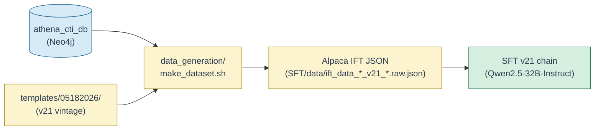

# Sophia `tmpl_gen`: Text Generation from Graphical Templates

## Author
Dr. Ionut Cardei and Mamoon Khan


`tmpl_gen` is a Python module and command-line tool for generating structured text from graph-based templates. It supports template expressions that reference nodes, edges, and node properties stored in a graph database such as Neo4j.

Its primary objective is to generate Instruction Fine-Tuning (IFT) triples for the Athena CTI LLM. The pipeline is driven by Sophia CTI templates and consumes the **12-source CTI graph** built by [`athena_cti_db`](../athena_cti_db/) — MITRE ATT&CK, MITRE ENGAGE, CAPEC, CWE, MITRE D3FEND, CVE Project, NVD CPE/CVSS, CISA KEV, FIRST EPSS, Sigma, ExploitDB, and PoC-in-GitHub — integrated in a Neo4j graph database.

The primary command-line entry point is `iftgen.py` in [`scripts/`](scripts/); the single-script wrapper that runs the full docx→triples→Alpaca pipeline is [`data_generation/make_dataset.sh`](data_generation/make_dataset.sh).

## Pipeline Position



**Upstream dependency.** `tmpl_gen` requires a populated `athena_cti_db` Neo4j instance to run — every template placeholder resolves to a graph query, and unpopulated nodes produce zero triples. Set up the database first (`athena_cti_db/utils/setup.sh`) before running any pipeline step here. See [`athena_cti_db/README.md`](../athena_cti_db/README.md) and [`athena_cti_db/FUNCTIONAL_SCOPE.md`](../athena_cti_db/FUNCTIONAL_SCOPE.md) for the substrate schema.

**Active vintage.** The current template set is **v21** under [`templates/05182026/`](templates/05182026/), feeding the v21 SFT chain (Core → +TAA → Final → Recalibrate) that targets `Qwen2.5-32B-Instruct` as the ship model. See [`templates/05182026/README-21.md`](templates/05182026/README-21.md) for the build recipe and [`SFT/SFT_FLOW.md`](../SFT/SFT_FLOW.md) for the downstream chain.

---

## Directories

- **[`src/tmpl_gen/`](src/tmpl_gen/)** — Core Python library containing the template parser, Neo4j query helpers, graph traversal utilities, and text generation logic. Install with `pip install -e .`.

- **[`scripts/`](scripts/)** — Command-line tools and utilities.
  - `iftgen.py` — main entry point: text generation, DB population, schema extraction
  - `tmpl_docx2json.py` — converts a `.docx` or `.json` template file to structured JSON
  - `to_alpaca.py` — converts triple JSON files to Alpaca fine-tuning format
  - `schemagraph.py` / `schemadiff.py` — schema visualization and comparison
  - `mini-parse.py` / `convert-templ.py` — template development and migration helpers

- **[`templates/`](templates/)** — Sophia CTI template files. See the [Templates README](templates/README.md).

- **[`data_generation/`](data_generation/)** — End-to-end IFT data generation pipeline.
  - `make_dataset.sh` — **single script** that runs the full pipeline (steps 1–3); accepts `.docx` or `.json` input
  - `docx2json.sh` — step 1: extract templates from a `.docx` file to JSON
  - `tmpl2triples.sh` — step 2: generate triples from template JSON using the CTI DB
  - `triples2alpaca.sh` — step 3: merge triple files into a single Alpaca-format dataset

- **[`schema-test/`](schema-test/)** — CTI DB schema validation tools. See the [schema-test README](schema-test/README.md).
  - `make-test-templates.sh` — generates test templates from the target schema XLSX
  - `test-CTI-schema.sh` — runs triple generation to verify nodes, properties, and relationships
  - `results_test_triples/_results-report.json` — output report for debugging DB schema issues

- **[`templates-athena/`](templates-athena/)** — Athena CTI DB connection config and schema snapshots for the production graph instance.
  - `neo4j-TEST-config.json` — connection parameters for the Athena DB
  - `schema-athena-cti.json` / `.gv` — schema snapshot in JSON and Graphviz format

- **[`docs/`](docs/)** — Design and reference documents.
  - `IFT-Design.pdf` — template syntax, generation configuration, and API design
  - `CTI-DB-Schema-details.pdf` — full CTI graph database schema reference
  - `cti-schema-target-2026-02.xlsx` — target schema summary used by schema-test tools

---

## Directory Structure

```
tmpl_gen/
├── pyproject.toml
├── README.md
├── install.sh
├── src/
│   └── tmpl_gen/
│       ├── __init__.py
│       ├── _version.py
│       ├── neo4j_utils.py
│       ├── priorityQ.py
│       ├── tmpl_parser.py
│       └── utils.py
├── scripts/
│   ├── iftgen.py
│   ├── tmpl_docx2json.py
│   ├── to_alpaca.py
│   ├── schemagraph.py
│   ├── schemadiff.py
│   ├── mini-parse.py
│   └── convert-templ.py
├── templates/
│   ├── README.md
│   ├── Sophia-CTI-Templates-04022026.docx
│   ├── Sophia-CTI-Templates-04022026.json
│   └── ...
├── data_generation/
│   ├── Readme.md
│   ├── make_dataset.sh
│   ├── docx2json.sh
│   ├── tmpl2triples.sh
│   ├── triples2alpaca.sh
│   ├── gencfg_default_neo4j.json
│   └── neo4j-local-config.json
├── schema-test/
│   ├── README.md
│   ├── make-test-templates.sh
│   ├── test-CTI-schema.sh
│   ├── create-test-tmpl.py
│   ├── test-templates.json
│   ├── test-templates+props.json
│   ├── gencfg_default_neo4j.json
│   └── neo4j-local-config.json
├── templates-athena/
│   ├── neo4j-TEST-config.json
│   ├── schema-athena-cti.json
│   └── schema-athena-cti.gv
└── docs/
    ├── IFT-Design.pdf
    ├── CTI-DB-Schema-details.pdf
    └── cti-schema-target-2026-02.xlsx
```

---

## Installation

### 1. Install the Package and Dependencies

Run the install script from the [`tmpl_gen/`](./) directory with your target environment active:

```bash
./install.sh       # standard install
./install.sh -e    # editable install (recommended for development)
```

Or install directly with pip:

```bash
pip install .      # standard install
pip install -e .   # editable install
```

The editable install makes the `tmpl_gen` module importable from anywhere and ensures code changes are reflected immediately without reinstalling.

A running neo4j server with the proper ASG CTI database is necessary for text generation to work.

---

---

## How to Generate IFT Data

### Quick Start: Single-Script Pipeline

Run the entire pipeline with one command from the [`data_generation/`](data_generation/) directory:

```bash
cd data_generation/
./make_dataset.sh <input> <results_dir> <alpaca_output.json> [count_limit] [count_max]
```

| Argument | Description | Default |
|---|---|---|
| `input` | `.docx` or `.json` template file | — |
| `results_dir` | directory for generated triples (**will be erased**) | — |
| `alpaca_output.json` | final Alpaca-format dataset file | — |
| `count_limit` | max generations per template in docx→JSON step | `10` |
| `count_max` | max triples per template in triple generation step | `2000` |

**Examples:**

```bash
# From a Word document (runs all 3 steps)
./make_dataset.sh ../templates/Sophia-CTI-Templates.docx results_dir alpaca.json

# From an existing JSON template file (skips step 1)
./make_dataset.sh ../templates/Sophia-CTI-Templates.json results_dir alpaca.json

# With custom limits
./make_dataset.sh ../templates/Sophia-CTI-Templates.docx results_dir alpaca.json 20 5000
```

The script runs three steps in sequence and prints progress for each. The intermediate template JSON file is written in the `data_generation/` directory when starting from a Word document.

#### Checking for Failed Templates

After the pipeline completes, inspect `_results-report.json` inside `results_dir` to check the `failed_count` — a value of `0` means all templates succeeded:

```bash
cat results_dir/_results-report.json
```

---

### Step-by-Step Pipeline

### 1. Add Your Template File

Place your template file in the [`templates/`](templates/) directory. Both `.docx` and `.json` formats are supported.

**JSON format** — each template is an object with `id`, `instruction`, `question`, and `answer` fields:

```json
[
    {
        "id": "M.1",
        "instruction": "You are a cybersecurity expert...",
        "question": "Explain ATT&CK technique {ap:attack-pattern.name} ({ap.id}) and how it is used.",
        "answer": "Technique {ap.name} ({ap.id}) is described as follows: {ap.description}."
    }
]
```

**DOCX format** — each template is a single paragraph with `Id Instruction: ... Question: ... Answer: ...` inline:

```
M.1 Instruction: You are a cybersecurity expert that has been trained to give precise responses to complex cybersecurity questions. You work in a SOC protecting data for enterprise customers helping to protect their digital assets. Question: Explain ATT&CK technique {ap:attack-pattern.name} ({ap.id}) and how it is used. Answer: Technique {ap.name} ({ap.id}) is described as follows:  {ap.description}. It is commonly observed across {ap.x_mitre_platforms}.
```

### 2. Configure Neo4j Credentials

Edit [`data_generation/neo4j-local-config.json`](data_generation/neo4j-local-config.json) with your CTI DB connection parameters:

```json
{
    "uri": "bolt://localhost:7687",
    "auth": ["neo4j", "your-password"],
    "db_name": "your-db-name",
    "nickname": "ASG-CTI"
}
```

### 3. Convert Template to JSON

Run `docx2json.sh` from the [`data_generation/`](data_generation/) directory to read your template file and convert it to JSON:

```bash
cd data_generation/
./docx2json.sh ../templates/your-templates.docx
# or
./docx2json.sh ../templates/your-templates.json
```

This produces `your-templates.json` in the current directory.

### 4. Generate Triples

Run the triple generation script against your template JSON file:

```bash
./tmpl2triples.sh your-templates.json your-saving-folder [count_limit]
```

- `your-templates.json` — the template JSON file produced in step 3
- `your-saving-folder` — directory where results will be written
- `count_limit` — optional maximum number of triples generated per template (default: `2000`)

Results are written to your saving folder, including one JSON file per template and a summary report `_results-report.json`. Check the `"failed_count"` field in this report to see how many templates failed to generate data — a value of `0` means all templates succeeded.

### 5. Convert to Alpaca Format

Merge all generated triples into a single Alpaca-format dataset:

```bash
./triples2alpaca.sh your-saving-folder/ alpaca.json
```

---

## Output Format

The final output of the pipeline is a JSON file in standard Alpaca format, where each entry contains three fields:

```json
[
    {
        "instruction": "You are a cybersecurity expert that has been trained to give precise responses to complex cybersecurity questions. You work in a SOC protecting data for enterprise customers helping to protect their digital assets.",
        "input": "Explain ATT&CK technique Phishing (T1566) and how it is used.",
        "output": "Technique Phishing (T1566) is described as follows: Adversaries may send phishing messages to gain access to victim systems. It is commonly observed across Windows, macOS, Linux."
    }
]
```

- `instruction` — the system-level role or context for the LLM
- `input` — the question derived from the template
- `output` — the answer generated by traversing the CTI graph


---
## Status

This project is in an early development stage. Template syntax, parser behavior, and API structure may evolve.

